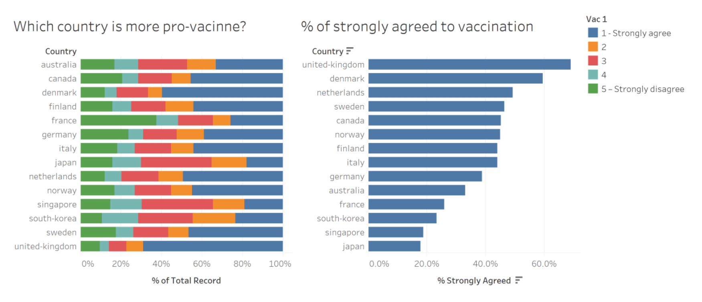

```{r setup, include=FALSE}
knitr::opts_chunk$set(echo = FALSE)
```

# 1. Introduction
COVID pandemic has impacted the world in unimaginable ways: work from home and zoom meetings are becoming norms; overseas travel almost comes to a complete halt; we might even start to forget that COVID confirmed cases and death are human beings, and not just numbers in a statistics. For the pandemic to be over, we need to achieve herd immunity either through recovery from infection or vaccine [@charumilind_craven_lamb_sabow_wilson_2021]. However, despite being eager of seeing the end to this calamity, people might also have worries and beliefs that make them hesitant to take the vaccine. 

Imperial College London Big Data Analytical Unit and YouGov [@jones_sarah_2020] conducted a survey that measures the people's behaviours in response to COVID-19. This data visualisation makeover will focus on the willingness of people in various countries to take the COVID vaccine.


# 2. Original Visualisation Evaluation
To start, we examine the original visualisation from the data (Figure 1) to learn what we can improve. The critiques are given in terms of **clarity** and **aesthetics**.



## 2.1 Clarity
### To keep:
   1. The countries graphs are shown in a **sorted order**. The left graph is shown in alphabetical order, while the right graph is shown in a descending order.
   1. The **usage of colour is consistent** between the two graphs. Both uses blue colour for strongly agree.
   1. The **axes and gridlines help the users to compare the values**.
   
### To be improved:
   1. Although the Likert Scale data is ordinal, the **choice of colour does not show an inherent order**. It would be better if a diverging colour scale is used, because the data has a meaningful central value, which is the neutral opinion [@yi_2019].
   1. Because the survey is conducted on a sample of the population, the actual proportion in the population might not be exactly the same. **Not visualising the uncertainty** can mislead the users, and thus we need to show the range of possible values [@torres_2016]. 
   1. It is **hard to compare the actual proportion of people who picked 2, 3, or 4 in the Likert Scale** because they do not have a common baseline.
   1. The **order of the countries are inconsistent** between the two graphs.
   1. The **title of the legend is not informative**.
   
## 2.2 Aesthetics
### To keep:
   1. The chart has a nice **font selection** that is easy to read and not unnecessarily embellished.
   1. The **number of tick marks is just nice** to allow comparison but not overly clutter the visualisation.
   1. The two **graphs are properly aligned**.
   1. **Labels have less colour intensity** so they do not distract the users.
  
### To be improved:
   1. The **choice of colours is too reliant on hue variation** instead of value or chroma, hence increasing the visual clutter [@Stone2006ChoosingCF]. It is better to limit the colour palette to 2 or 3 hues and use variation of colour intensity to make the visualisation more aesthetically pleasing and functional.
   1. **Country names are not formatted properly**. There is no capitalisation and there are dashes in the names.
   1. **Decimal points are inconsistent in the axes**. The left graph has no decimal points but the right one has 1 decimal points.
   1. **Labels of the colour legend are inconsistent**. Value 1 and 5 have a text explanation, while 2, 3, and 4 are just numbers.
