```{r setup, include=FALSE}
knitr::opts_chunk$set(echo = FALSE)
```

# 1. Introduction
We are living in a world that is constantly producing a vast amount of data, and data visualisation helps us to understand the data better. However, a poor visualisation can be of little value, or even misleading. Visual analytics is not just about creating a pretty chart, but it is the marriage of data analytics and visualizations that aims to detect the expected and discover the unexpected. 

This post will makeover Chart 6: Resident Labour Force by age group from page 22 of [Labour Force in Singapore 2019 Report](https://stats.mom.gov.sg/Pages/Labour-Force-In-Singapore-2019.aspx). 

# 2. Original Visualization
To start, we examine the original visualisation from the data (Figure 1) to learn what we can improve. The critique is given in terms of **clarity** and **aesthetics**.

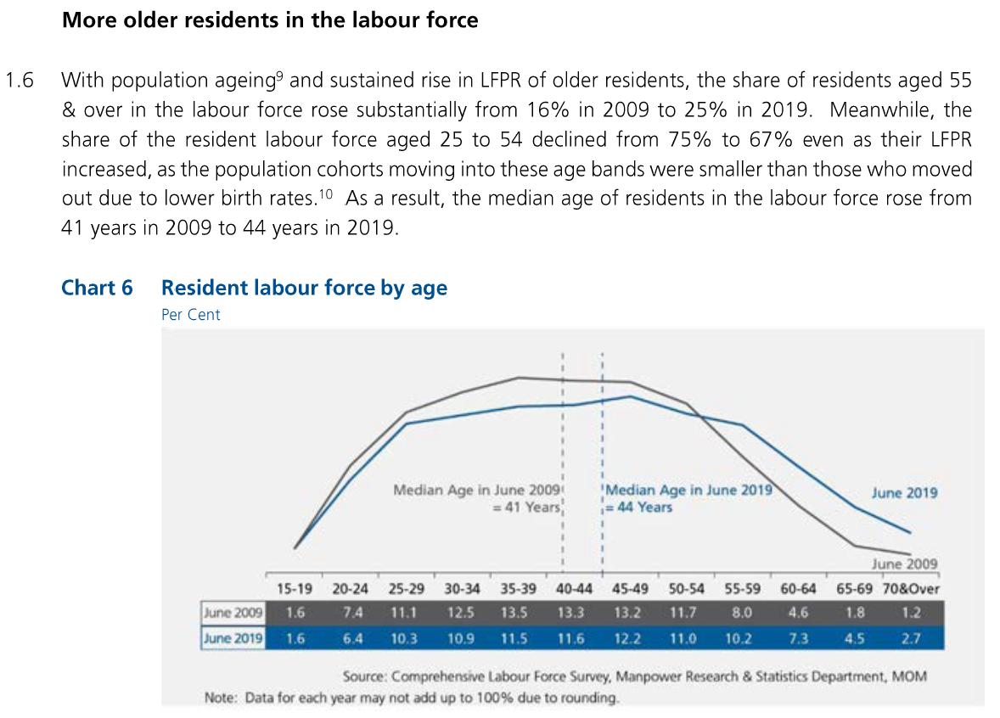


## 2.1 Clarity:
   1. **Poor choice of chart gives the impression that they are comparing the distribution of age in two categories**, for example the age distribution in male and female residents. To represent how values change over time, line chart is a better choice than histogram.
   1. It is **difficult to see the values of the data points** in the chart. The graph does not have axis and thus we need to depend on the labels to see the actual value of each data point. However, these labels are put below the chart as a table, and not on the chart itself.
   1. There is an inconsistency between the statement and the chart. While the statement mentions a decline in 25 - 54 age group as well as an increase in 55 & over age group, the readers are not able to find the values on the chart itself. These are a summation of multiple categories from the chart and the **readers must manually sum the numbers together to get the the values mentioned in the statement**.
   1. The statement mentioned rise of Labour Force Participation Rate (LFPR) and population size per age group, but **the chart also does not have any reference to LFPR or population size per age group**.

## 2.2 Aesthetics:
   1. The chart is not exported in good quality. It is **quite pixelated**, even in the original report.
   1. Using a **very short subtitle 'Per Cent' creates an awkward empty space above the chart**. It would be better to add it to the title, or omit the subtitle altogether.
   1. Although the report uses a white background, the chart has a **grey background** colour. Background colour is an unnecessary non data-ink which does not add value in helping to understand the data better.

# 3. Alternative Graphical Representation

Figure 2 shows the alternative graphical representation proposed for the makeover.

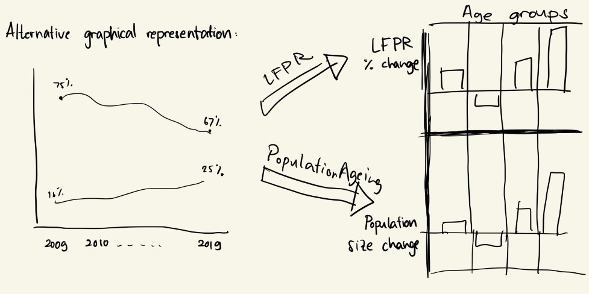

The issues that the alternative design tries to overcome are:

   1. To **clearly show the difference of workforce distribution over time** by the use of line chart instead of histogram.
   1. To **further categorise the age groups** together to the same level as the point of interest in the statement, so that the readers can see the value directly without having to calculate the total from different subgroups. 
   1. To **show the LFPR and population size per age group**. This alternative representation will directly show the difference between 2019 and 2009 values instead of showing another line charts because they are just additional information.
   1. **To remove unnecessary non-data-ink** by using a white background (Note: The colour on the proposed design is from the paper, which is not going to be used in the final chart).

# 4. Step-by-Step Description

## 4.1 Data Source

There is no visualisation and analytics if there is no data.
The data that will be used are:

No | Data          | Source
---|--------------|-------------------
1. |Resident Labour Force by Age | [Labour Force 2019 Report, Table 7](https://stats.mom.gov.sg/iMAS_Tables1/LabourForce/LabourForce_2019/mrsd_2019LabourForce_T7.xlsx)
2. |Labour Force Participation Rate by Age | [Labour Force 2019 Report, Table 5](https://stats.mom.gov.sg/iMAS_Tables1/LabourForce/LabourForce_2019/mrsd_2019LabourForce_T5.xlsx)
3. |Population Size by Age | [Singapore Department of Statistics](https://www.tablebuilder.singstat.gov.sg/publicfacing/createDataTable.action?refId=14911)


## 4.2 Resident Labour Force Line Chart

This chart will show how percentage of each age groups of interest in the Resident Labour Force changes through the course of 2009 to 2019. Steps to create the visualisation is shown below.

### Data Preparation
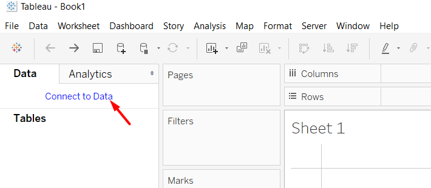

* Create a new workbook and click **Connect to Data**.
* Choose the data source (In this case, it would be Table 7 from Labour Force Report 2019).

! [Figure 4. Add Table](./images/4.2. Drag Table.png)

* **Drag the table that we want** to the workspace. We are interested in the total number, not in the distribution of gender. Therefore, we can use T7_T that contains the total number of males and females.

* Check the **Use Data Interpreter** checkbox to allow Tableau to do automatic cleaning. Tableau is able to intelligently detect valuable columns and rows, and drop the empty ones.

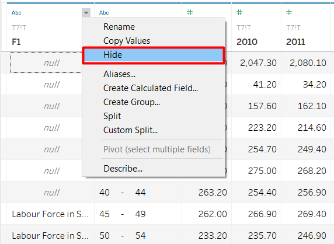

After the cleaning, we still have a column that we are not interested in. There are some values in the column, but it is just an annotation. 

* **Hover to the column header** that we want to hide.
* Click the **grey inverted triangle** > **Hide**

The first row in the table has null in the Age column. This value is the total from all Age groups, which we can obtain with the SUM function later. We can filter out this row.

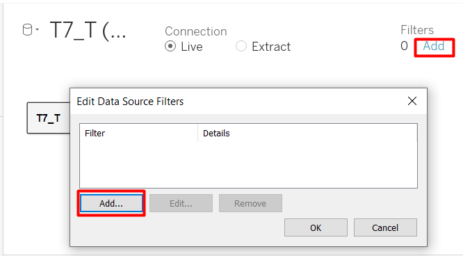

* In the top right-hand corner, under Filters, click **Add**.
* Click **Add** again in the Edit Data Source Filters window
* Select the **Age** field > **OK**

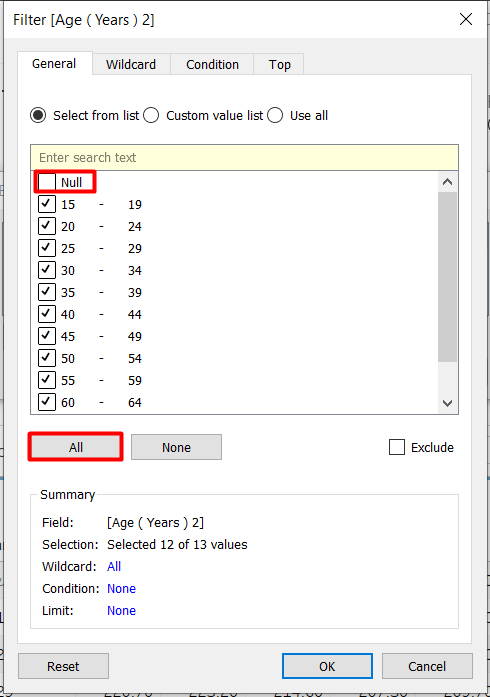

We can either select None and manually check the data items we want one-by-one, or check all boxes first and unselect the one we do not want. Since we only want to remove one age group, we will do the latter. 

* Select **All**.
* **Uncheck the Null box** > **OK**

The table is currently in a wide format, but we want it to be long and thin so we can assign the years as a Date variable. We can use the pivot function from Tableau.

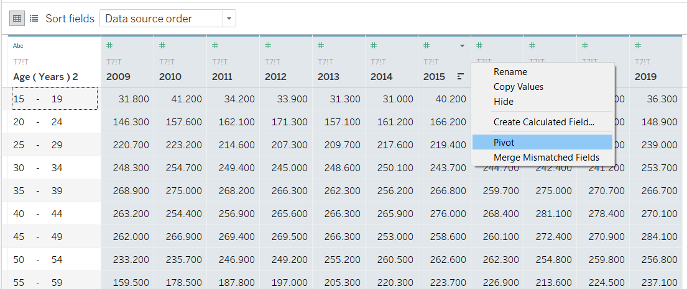

* **Select all the columns** with the year as the header column. We can do this by holding Ctrl button while selecting the columns or holding Shift button and select the first (2009) and last (2019) column that we want.
* **Right-click** on any of the column header > **Pivot**

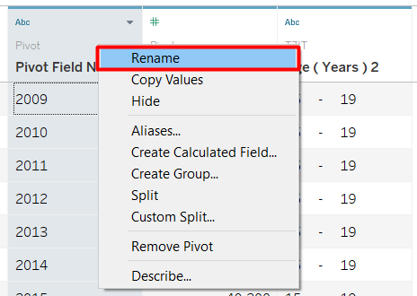

The data is now transformed to a thin table with three columns. The original column headers are stored in Pivot Field Names, while the values are stored in Pivot Field Values. Rename the columns to make it easier to understand.

* **Right-click** on the column header > **Rename**

The original and new column names are shown below.

**Original Column Name** | **New Column Name**
-------------------------|---------------------
Pivot Field Names | Year
Pivot Field Values | Resident Labour Force
Age (Years) 2 | Age

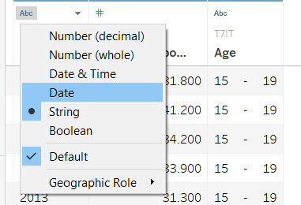

Notice that there is an 'Abc' symbol above the column Age and Year. This means the two variables are considered String Variables. However, we want the Year to have a Date data type. 
* Click the **'Abc'** symbol in Year column header > **Date**

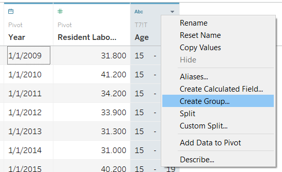

Next, one of the improvement we want to make on the original visualisation is to group the age variable so it will be the same as the age groups that are mentioned in the statement. Therefore, we need to group into 25 - 54 and 55 & over. Age group 15 - 24 will be created even though it is not mentioned in the statement to show that the numbers sum to 100%.

* **Right-click** on Age column header > **Create group...**

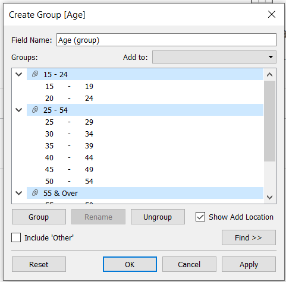

* **Select** the **ages** that we want to group together (e.g. 15 - 19 and 20 - 24), then press **Group**
* **Enter** the appropriate **group name**
* **Repeat** to get three age groups as shown in Figure 12 > **OK**
