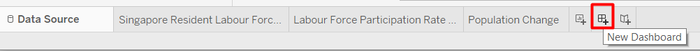

```{r setup, include=FALSE}
knitr::opts_chunk$set(echo = FALSE)
```

# 1. Introduction
We are living in a world that is constantly producing a vast amount of data, and data visualisation helps us to understand the data better. However, a poor visualisation can be of little value, or even misleading. Visual analytics is not just about creating a pretty chart, but it is the marriage of data analytics and visualizations that aims to detect the expected and discover the unexpected. 

This post will makeover Chart 6: Resident Labour Force by age group from page 22 of [Labour Force in Singapore 2019 Report](https://stats.mom.gov.sg/Pages/Labour-Force-In-Singapore-2019.aspx). 

# 2. Original Visualization
To start, we examine the original visualisation from the data (Figure 1) to learn what we can improve. The critique is given in terms of **clarity** and **aesthetics**.


## 2.1 Clarity:
### To keep:
   1. **Usage of colours** are consistent. All 2009 data uses grey colour, while 2019 data uses blue.
   1. **Useful annotations** such as **reference lines** and **labels** for the median are added. 
   1. **Source of the data is listed**.
   
### To be improved:
   1. **Poor choice of chart gives the impression that they are comparing the distribution of age in two categories**, for example the age distribution in male and female residents. To represent how values change over time, line chart is a better choice than histogram.
   1. It is **difficult to see the values of the data points** in the chart. The graph does not have axis and thus we need to depend on the labels to see the actual value of each data point. However, these labels are put below the chart as a table, and not on the chart itself.
   1. The only place where it is mentioned that the values are in percentage is in the subtitle, which is also in an awkward place. It might be better to **use the '%' suffix** in the value labels.
   1. There is an inconsistency between the statement and the chart. While the statement mentions a decline in 25 - 54 age group as well as an increase in 55 & over age group, the readers are not able to find the values on the chart itself. These are a summation of multiple categories from the chart and the **readers must manually sum the numbers together to get the the values mentioned in the statement**.
   1. The statement mentioned rise of Labour Force Participation Rate (LFPR) and population size per age group, but **the chart also does not have any reference to LFPR or population size per age group**.

## 2.2 Aesthetics:
### To keep:
   1. The **choice of colours** are easy on the eye and looks elegant.
   1. The chart has a nice **font selection** that is easy to read and not unnecessarily embellished.
   1. There is **no distracting** grid lines.
   
### To be improved:
   1. The chart is not exported in good quality. It is **quite pixelated**, even in the original report.
   1. Using a **very short subtitle 'Per Cent' creates an awkward empty space above the chart**. It would be better to add it to the title, or omit the subtitle altogether.
   1. Although the report uses a white background, the chart has a **grey background** colour. Background colour is an unnecessary non data-ink which does not add value in helping to understand the data better.

# 3. Alternative Graphical Representation
Figure 2 shows the alternative graphical representation proposed for the makeover.


The issues that the alternative design tries to overcome are:

   1. To **clearly show the difference of workforce distribution over time** by the use of line chart instead of histogram.
   1. To **further categorise the age groups** together to the same level as the point of interest in the statement, so that the readers can see the value directly without having to calculate the total from different subgroups. 
   1. To **show the LFPR and population size per age group**. This alternative representation will directly show the difference between 2019 and 2009 values instead of showing another line charts because they are just additional information.
   1. To **add % suffix in the value labels**.
   1. **To remove unnecessary non-data-ink** by using a white background (Note: The colour on the proposed design is from the paper, which is not going to be used in the final chart).
   
Additionally, the visualisation will include **title and lead-in** that highlight the important observations, as well as maintaining the good points from the original charts, such as the **choice of fonts and colours**.
   
### Update:


As the visualisation is being created, there are some slight deviations from the original plan. The changes are as the following:

   1. I could not find a way to remove the gridlines and rotate the y-axis labels if I create a trellis chart. Therefore, I decided to create **2 separate bar charts** instead, but I will maintain the order of the age groups. 
   1. **Annotations added** to the line chart to reduce awkward empty spaces.
   1. The two **supporting charts are placed directly next to the line chart** so it will look more coherent.
   
The final look of the data visualisation makeover is shown in Figure 4. It is also available in [Tableau Public](https://public.tableau.com/profile/gabriella.pauline.djojosaputro#!/vizhome/ResidentLabourForceinSingapore2009-2019/MoreolderresidentsareinSingaporeworkforcein2019comparedto2009).


# 4. Step-by-Step Description
In this section, we are going through the steps to recreate the Data Visualisation Makeover shown in Figure 4 using Tableau. Tableau Desktop has a 14-day trial that can be downloaded [here](https://www.tableau.com/products/desktop/download). The steps might be too detailed, but they are designed so that beginners with no Tableau experience can follow the tutorial easily.

## 4.1 Data Source
There is no visualisation and analytics if there is no data.
The data that will be used are:

No | Data          | Source
---|--------------|-------------------
1. |Resident Labour Force by Age | [Labour Force 2019 Report, Table 7](https://stats.mom.gov.sg/iMAS_Tables1/LabourForce/LabourForce_2019/mrsd_2019LabourForce_T7.xlsx)
2. |Labour Force Participation Rate by Age | [Labour Force 2019 Report, Table 5](https://stats.mom.gov.sg/iMAS_Tables1/LabourForce/LabourForce_2019/mrsd_2019LabourForce_T5.xlsx)
3. |Population Size by Age | [Singapore Department of Statistics](https://www.tablebuilder.singstat.gov.sg/publicfacing/createDataTable.action?refId=14911)


## 4.2 Resident Labour Force Line Chart
This chart will show how percentage of each age groups of interest in the Resident Labour Force changes through the course of 2009 to 2019. Steps to create the visualisation is shown below.

### Data Preparation


* Create a new workbook and click **Connect to Data**.
* Choose the **file type** > **file name** (In this case, it would be Table 7 from Labour Force Report 2019).

! [Figure 6. Add Table](./images/4.2. Drag Table.png)

* **Drag the table that we want** to the workspace. We are interested in the total number, not in the distribution of gender. Therefore, we can use T7_T that contains the total number of males and females.

* Check the **Use Data Interpreter** checkbox to allow Tableau to do automatic cleaning. Tableau is able to intelligently detect valuable columns and rows, and drop the empty ones.

{width=75%}

After the cleaning, we still have a column that we are not interested in. There are some values in the column, but it is just an annotation. 

* **Hover to the column header** that we want to hide.
* Click the **grey inverted triangle** > **Hide**.

The first row in the table has null in the Age column. This value is the total from all Age groups, which we can obtain with the SUM function later. We can filter out this row.


* In the top right-hand corner, under Filters, click **Add**.
* Click **Add** again in the Edit Data Source Filters window.
* Select the **Age** field > **OK**.

{width=50%}

We can either select None and manually check the data items we want one-by-one, or check all boxes first and unselect the one we do not want. Since we only want to remove one age group, we will do the latter. 

* Select **All**.
* **Uncheck the Null box** > **OK**.

The table is currently in a wide format, but we want it to be long and thin so we can assign the years as a Date variable. We can use the pivot function from Tableau.


* **Select all the columns** with the year as the header column. We can do this by holding Ctrl button while selecting the columns or holding Shift button and select the first (2009) and last (2019) column that we want.
* **Right-click** on any of the column header > **Pivot**.

{width=60%}

The data is now transformed to a thin table with three columns. The original column headers are stored in Pivot Field Names, while the values are stored in Pivot Field Values. Rename the columns to make it easier to understand.

* **Right-click** on the column header > **Rename**.

The original and new column names are shown below.

**Original Column Name** | **New Column Name**
-------------------------|---------------------
Pivot Field Names | Year
Pivot Field Values | Resident Labour Force
Age (Years) 2 | Age

{width=60%}

Notice that there is an 'Abc' symbol above the column Age and Year. This means the two variables are considered String Variables. However, we want the Year to have a Date data type. 
* Click the **'Abc'** symbol in Year column header > **Date**.

{width=60%}

Next, one of the improvement we want to make on the original visualisation is to group the age variable so it will be the same as the age groups that are mentioned in the statement. Therefore, we need to group into 25 - 54 and 55 & over. Age group 15 - 24 will be created even though it is not mentioned in the statement to show that the numbers sum to 100%.

* **Right-click** on Age column header > **Create Group...**

{width=55%}

* **Select** the **ages** that we want to group together (e.g. 15 - 19 and 20 - 24), then press **Group**.
* **Enter** the appropriate **group name**.
* **Repeat** to get three age groups as shown in Figure 12 > **OK**.

{width=60%}

The current value that we have for Resident Labour Force is absolute value, but we are interested in the distribution of age in the workforce. We can get this value by doing a quick table calculation or creating calculated field. This post will use the latter method.We need to create two calculated fields: Total Resident Labour Force and Percentage of Total Resident Labour Force.

* **Right-click** on the **Resident Labour Force** column header > **Create Calculated Field...**


The formula shown above calculates the total number of people in the Resident Labour Force per year.

* **Enter formula shown in Figure 14**.
* **Enter calculated field name name** (I used 'Total Resident Labour Force).
* **Repeat** for **Percentage of Total Resident Labour Force** field using the following formula:

> [Resident Labour Force]/[Total Resident Labour Force]

{width=60%}

We are done! We can go to the **Sheet1** Tab in the bottom left-hand corner.

### Creating Visualisation
Sheet is where we can build visualisation. The general layout in Tableau interface is shown in Figure 16. 


We can build visualisation by dragging the fields from the data pane directly to the canvast or to the shelves. Depending on where we drop the fields, they will take on different roles in the visualisation. To create the line chart for the Resident Labour Force by age group, we will drag the following fields to the column.


* **Drag Year** to **Columns** shelf.
* **Drag % of Total Resident Labour Force** to **Rows** shelf.

Notice that Tableau automatically recommends a line chart to visualise our data. Don't be alarmed that it is only displaying a straight line. Right now it computes the total percentage of all group, that is why it is always 100%. Next, we need to separate the age groups.


* **Drag Age (group)** to the **Color Marks Card**.

### Customisation
We can further customise the chart appearance to enhance the usefulness and readability of the chart. There are several customisations on the line chart that we are going to perform.

#### Label


* **Drag % of Total Resident Labour Force** to the **Text Marks Card**.
* **Double-click** on **Text Marks Card** to open the settings.
* Select **Line Ends** to make the labels only appear on the line end. Otherwise, the chart will be too cluttered.


* **Right-click** on one of the labels > **Format...** to open the Format Pane.
* Click on **Fields** on the top right-hand corner of the Format Pane and click **SUM(% of Total Resident Labour Force)** that we used for the label.
* Click **Numbers** > **Percentage** to display the number in percentage form instead of decimal points.

#### Axis / Header
As we have already labeled the data points of interest, the y-axis is no longer necessary. We can remove the axis to increase our data-ink ratio. 

{width=50%}

* **Right-click** on the y-axis > **Uncheck Show Header**.

{width=60%}

* Likewise, **right-click** on **Year** header on the top of the chart > **Hide Field Labels for columns because the year is already quite self-explanatory.

#### Line Markers


* Click on **Color Marks Card** and select **All** markers which is the middle option. This will make it easier to see the individual data points.


#### Title
Our current default title is the sheet name, which is Sheet 1. We can change the sheet name, and further tailor the title to make it more informative. 

{width=75%}

* Pretty self-explanatory. **Double-click** on the **Sheet 1 Tab** below, then we can type in the desired name. I put 'Singapore Resident Labour Force by Age Group'.


* **Double-click** on the sheet title.
* Write the desired title. We can also adjust the font size and formatting. 

'<Sheet Name>' means the value is dynamic. Whenever the sheet name changes, the title will follow accordingly. We can also add other variables by clicking **Insert**. However, we are not adding other variables now.

#### Annotations
We can also annotate on the chart itself to highlight interesting findings. 

{width=55%}

* **Right-click** on one of the data point > **Annotate** > **Mark...**.

{width=80%}

* Add findings that we want to highlight.

Just like the sheet title, we can customise the annotation and make use of the variables using the **Insert** button. And now, we are done for this line chart! We can adjust the width and height of the chart by hovering to the right side or below the chart until our cursor turns into a double-sided arrow and drag accordingly.


## 4.3. Labour Force Participation Rate Bar Chart
Next, the statement mentions that the increase in older residents in Singapore Labour Force is due to the rise in Labour Force Participation Rate for older residents. We are going to visualise this data to support the statement. Some steps are the same as what was explained in the previous section.

### Data Preparation


* Go back to the **Data Source** tab.
* Click the **database icon** (cylinder) next to the data source name > **New Data Source** .
* Choose the **file type** > select the **file** (Table 5 from Labour Force Report 2019).
* **Drag** the **T5_T** table.
* Check **Use Data Interpreter**.
* **Hide** the first column (F1).


If we scroll down and see the bottom of the data table, we can see that they have already grouped the age. Therefore, we can filter out the 5-year age bins on the top. 

* Click **Add** below the word Filters on the top right-hand corner of the screen > Add.
* Select the **Age** field (shown as Age(Years) 1 in my Tableau) > **OK**.
* Only keep 15 - 24, 24 - 54, 55 - 64, and 65 & Over age groups.
* Group the 55 - 64 and 65 & Over groups together and give 55 & Over as the group name.


The spacing seem to be very wide for the age groups. Since we are using a live connection, any update on the data source will be reflected in Tableau. I opened the Excel file to manually fix the spacing. 


Although this data is also in a wide format, we only need the difference between 2019 and 2009 data. We do not need to pivot the table, but we need to create a calculated field for the difference. 

* **Right0click** on **2019** column > **Create Calculated Field...**
* Enter the formula shown in Figure 31.

{width=75%}

We are done preparing the data. Now we can create the second chart on a new worksheet.

* Click on the **New Worksheet** icon. It is the tab directly next to our line chart tab.

### Create Visualisation 


For the bar chart, we want to have 3 bars that show the change of Labour Force Participation Rate between 2009 and 2019. 

* **Drag Age group** field to the **Columns** shelf.
* **Drag Labour Force Participation Rate % Change** field to the **Rows** shelf.

### Customisation
First, we are going to add the colour and label to make the bar chart easier to see.


* **Drag Labour Force Participation Rate % Change** field to **Color** and **Label Marks Card**

#### Colour
If we see the color legend on the right, we can see that the range does not start from 0, it only uses the smallest and the biggest value. The purpose of changing the colour to to quickly highlight the positive and negative values as well as showing the significance of the change. Colour is a pre-attentive attribute, so we can quickly notice the difference in colour.


* **Double-click** on the colour legend.
* Choose **Orange-Blue Diverging** palette.
* Select **Use Full Color Range**.
* Click **Advanced**.
* Set the color so it will diverge from the **Center** at **0**.

The colour of the bars may not change now because all the values are positive. It is okay.

#### Label
Even though the Labour Force Participation Rate % Change is a percentage, the number is not between 0 and 1. Therefore, we will use a slightly different method to display the '%' sign.


* Open the format pane like how we did it for the line chart.
* Change the **Fields** to **SUM(Labour Force Participation Rate % Change)**
* Choose **Numbers** > **Numbers (Custom)**
* Reduce the **Decimal places** to **1**
* Add **%** in the **Suffix**

Now that the bar is labeled, we can take away the unnecessary axis and headers using the same steps as in the previous section. Remember to rename the sheet name and put a proper title.


## 4.4. Population Size Change Bar Chart
The steps to create the Population Size Change Bar Chart is exactly the same as the Labour Force, except we are using a different dataset and we are not displaying '%' sign in the suffix. 


## 4.5. Dashboard
Now, it is time to combine the various charts that we have created.



* To create new dashboard, click the **New Dashboard Tab**, which is the second tab to the right of our last worksheet.


* Adjust the **Size** to your preference. Automatic means the size will adjust according to the device, but I found that using Automatic can cause problems in the alignment. I chose **Desktop Browser(1000x800)**


* To add sheet to the dashboard **drag the sheet name to the canvas**.
* **Hold** and **hover** around the dashboard to see a highlighted box, that will be the space that the sheet take up if we release our mouse. 

By default, Tableau uses a Tiled layout. To better arrange our sheet, we can make use of the objects. 


Vertical object allows us to have a vertical grid that we an fill in with sheets or another objects. 

* **Drag Vertical Object** to the canvas.
* Click on the **sheet** that we already put to the dashboard.
* **Hover** to the **grey rectangle** above the sheet until it turns to a four-sided arrow
* **Drag** the sheet into the vertical object

Similarly, we can use blank to add paddings around the objects (such as to align the sheets), add horizontal grid, text, etc.


Since we have annotated the line chart and the colour in the bar charts are to highlight positive and negative values, the legends are not necessary.

* Click on the **legend**.
* Click on the **cross** to remove from the dashboard.

{width=25%}

To create a title and lead-in for the dashboard, we can either use a Text object or use the dashboard title itself. The **Show dashboard title** checkbox highlighted in Figure 45 will make the dashboard title appear.


The final dashboard that I created is shown in Figure 46, marked with colour-coded rectangles to show what object I used to arrange them. 

**Congratulations, we have completed our dashboard!** 

# 5. Major Observations


1. **Due to the rapidly rising population size of older residents, having more older residents in the workforce is natural, or even preferable**. As the distribution of population is getting more and more skewed, Singapore's [**old-age support ratio**](https://www.singstat.gov.sg/modules/infographics/old-age-support-ratio) will continue to decrease. Old-age support ratio is the number of people who are financially productive compared to the number of older people who may be dependent on others' support ([Singapore Department of Statistics](https://www.singstat.gov.sg/modules/infographics/old-age-support-ratio)). The increase of Labour Force Participation Rate in older residents helps to reduce the number of older residents that depend on others' support. 
1. The increase in population size in 55 & Over age group is incomparable to the decrease in population size of 25 - 54 age group. This means that **the majority of people in the 55 & Over age group in 2009 are still alive in 2019**, which can be attributed to Singapore's excellent healthcare system. We will **continue to see rising number of older residents in the workforce** before the ratio will **reach an equilibrium as long as the population size of younger residents does not continue to decline**.
1. As the increase in Labour Force Participation Rate is not as high in 15 - 24 and 25 - 54 age groups compared to the 55 & Over age group, another way to sustain the old-age support ratio is to **increase the Labour Force Participation Rate in the younger residents**. Non-working residents in the younger age groups are most likely students or stay-at-home mother. **Finding out the reason they choose not to participate in the labour force** is a necessary step if we want to encourage them to enter the workforce.

