```{r setup, include=FALSE}
knitr::opts_chunk$set(echo = FALSE)
```

# 1. Introduction
COVID pandemic has impacted the world in unimaginable ways: work from home and zoom meetings are becoming norms; overseas travel almost comes to a complete halt; we might even start to forget that COVID confirmed cases and death are human beings, and not just numbers in a statistics. For the pandemic to be over, we need to achieve herd immunity either through recovery from infection or vaccine [@charumilind_craven_lamb_sabow_wilson_2021]. However, despite being eager of seeing the end to this calamity, people might also have worries and beliefs that make them hesitant to take the vaccine. 

Imperial College London Big Data Analytical Unit and YouGov [@jones_sarah_2020] conducted a survey that measures the people's behaviours in response to COVID-19. This data visualisation makeover will focus on the willingness of people in various countries to take the COVID vaccine.


# 2. Original Visualisation Evaluation
To start, we examine the original visualisation from the data (Figure 1) to learn what we can improve. The critiques are given in terms of **clarity** and **aesthetics**.


## 2.1 Clarity
### To keep:
   1. The countries graphs are shown in a **sorted order**. The left graph is shown in alphabetical order, while the right graph is shown in a descending order.
   1. The **usage of colour is consistent** between the two graphs. Both uses blue colour for strongly agree.
   1. The **axes and gridlines help the users to compare the values**.
   
### To be improved:
   1. Although the Likert Scale data is ordinal, the **choice of colour does not show an inherent order**. It would be better if a diverging colour scale is used, because the data has a meaningful central value, which is the neutral opinion [@yi_2019].
   1. Because the survey is conducted on a sample of the population, the actual proportion in the population might not be exactly the same. **Not visualising the uncertainty** can mislead the users, and thus we need to show the range of possible values [@torres_2016]. 
   1. It is **hard to compare the actual proportion of people who picked 2, 3, or 4 in the Likert Scale** because they do not have a common baseline.
   1. The **order of the countries are inconsistent** between the two graphs.
   1. The **title of the legend is not informative**.
   
## 2.2 Aesthetics
### To keep:
   1. The chart has a nice **font selection** that is easy to read and not unnecessarily embellished.
   1. The **number of tick marks is just nice** to allow comparison but not overly clutter the visualisation.
   1. The two **graphs are properly aligned**.
   1. **Labels have less colour intensity** so they do not distract the users.
  
### To be improved:
   1. The **choice of colours is too reliant on hue variation** instead of value or chroma, hence increasing the visual clutter [@Stone2006ChoosingCF]. It is better to limit the colour palette to 2 or 3 hues and use variation of colour intensity to make the visualisation more aesthetically pleasing and functional.
   1. **Country names are not formatted properly**. There is no capitalisation and there are dashes in the names.
   1. **Decimal points are inconsistent in the axes**. The left graph has no decimal points but the right one has 1 decimal points.
   1. **Labels of the colour legend are inconsistent**. Value 1 and 5 have a text explanation, while 2, 3, and 4 are just numbers.

# 3. Alternative Graphical Representation
Figure 2 shows the alternative graphical representation proposed for the makeover.

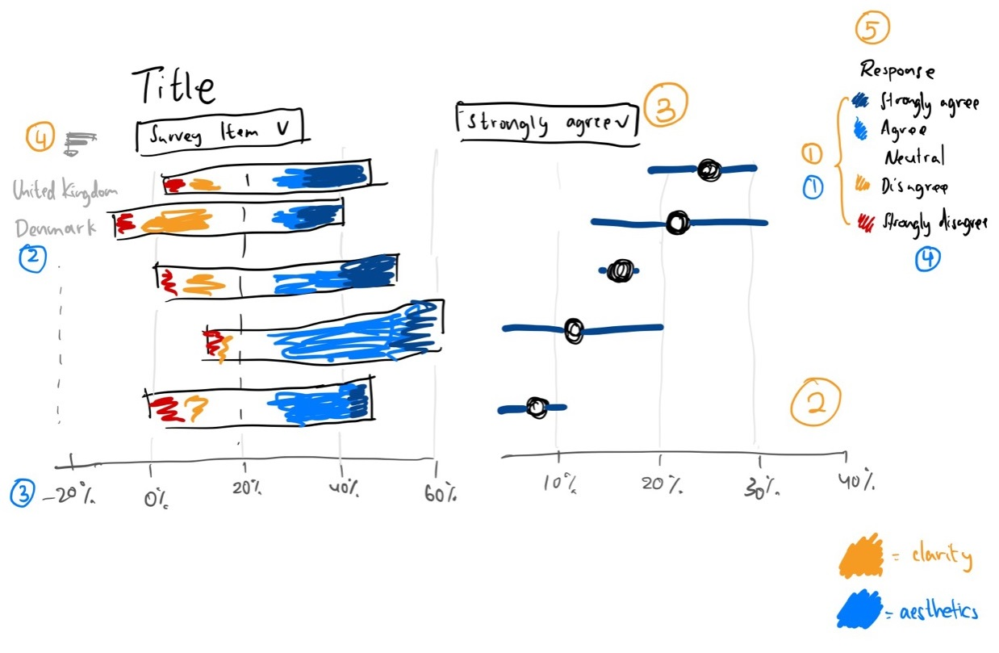

The survey data uses a 5-point Likert scale for the respondents to rate the statements. There are multiple ways to visualise Likert scale data, such as a 100% stacked bar chart as in the original visualisation, multiple pie charts, diverging stacked bar chart, and so on [@pirrone_2020].

Diverging stacked bar chart will help to compare the positive and negative sentiment more clearly, but there are multiple views of how to categorise neutral opinion. Having the middle of the neutral proportion as the center line makes it hard to compare the values because there is no common baseline [@wexler_2020]. Therefore, the first part of the alternative design is a diverging stacked bar chart, in which we will split the neutral opinion and put it at the outermost part of the stacked bar.

The second part of the alternative design is a dot plot with error bar that indicates the confidence interval of the proportion. This will show the underlying variation in the data and prevent misleading the users. 

The issues from the original visualisation that the alternative design tries to overcome is colour-coded in Figure 2, with orange numbers corresponding to critiques for clarity and blue numbers for critiques with regards to aesthetics.

### Clarity:
   1. To show an order in the survey response using a **diverging colour scale**.
   1. To show the uncertainty using an **error bar** in the dot plot.
   1. To **allow the users to toggle between different response of interest**. The users may choose to view individual percentage and error bars for 'Strongly Agree', 'Agree', 'Neutral', 'Disagree', and 'Strongly Disagree'.
   1. To **sort the order of countries in both graphs consistently** in descending manner according to the selected response of interest in the right graph.
   
### Aesthetics:
   1. To **limit the colour palette** and utilise a variation of colour intensity on top of differing hue.
   1. To use **proper capitalisation and formatting for the country name** labels.
   1. To **standardise the axes labels to show no decimal points**.
   1. To **label the colour legends consistently using a textual explanation**.
   
### Additional Features:
   1. To **allow the users to visualise different survey items**. The users can see the response for questions such as whether the respondents are afraid of COVID vaccine side effects, not just restricted to whether or not they are willing to take the vaccine.
   1. To **use animation to show the transitions** between different selected parameters, so the users can easily notice if the ranks of the countries change.
   
The final look of the data visualisation makeover is shown in Figure 3. It is also available in **!!!!**


# 4. Step-by-Step Description
In this section, we are going through the steps to recreate the Data Visualisation Makeover shown in Figure 3 using Tableau. Tableau Desktop has a 14-day trial that can be downloaded [here](https://www.tableau.com/products/desktop/download). 

## 4.1 Data Preparation
### Data Source
The visualisation is based on the publicly available [Imperial College London YouGov Covid 19 Behaviour Tracker Data Hub](https://github.com/YouGov-Data/covid-19-tracker), which aims to get insights or how people respond to COVID-19. They also publish a [dashboard](https://ichpanalytics.imperialcollegehealthpartners.com/t/BDAU/views/YouGovICLCOVID-19BehaviourTracker/Homepage) to visualise the data.

### Data Cleaning
As the survey was done in a large scale and measures a wide variety of behavioural responses, there are a lot of columns that we do not need. Reducing the size of the dataset is necessary to speed up Tableau, and ensure we do not drown in the data ;)

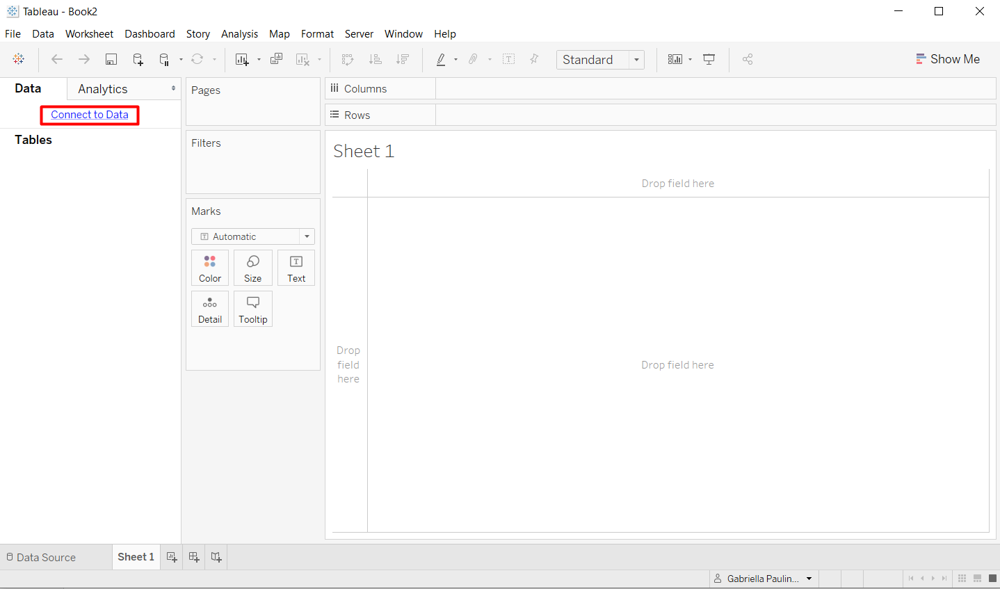

* Create a **New Workbook**.
* Click **Connect to Data**.
* Select the **data type** and browse to **select any one of the csv** (The data comes in multiple csv files, one for each country).

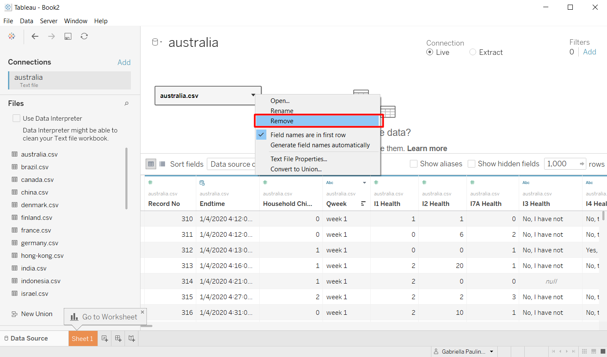

Next, we need to join all the files using the Union function from Tableau. Ensure the workspace has no tables to prevent errors when we join the csv files.

* **Right-click** on the **table** > **Remove**.

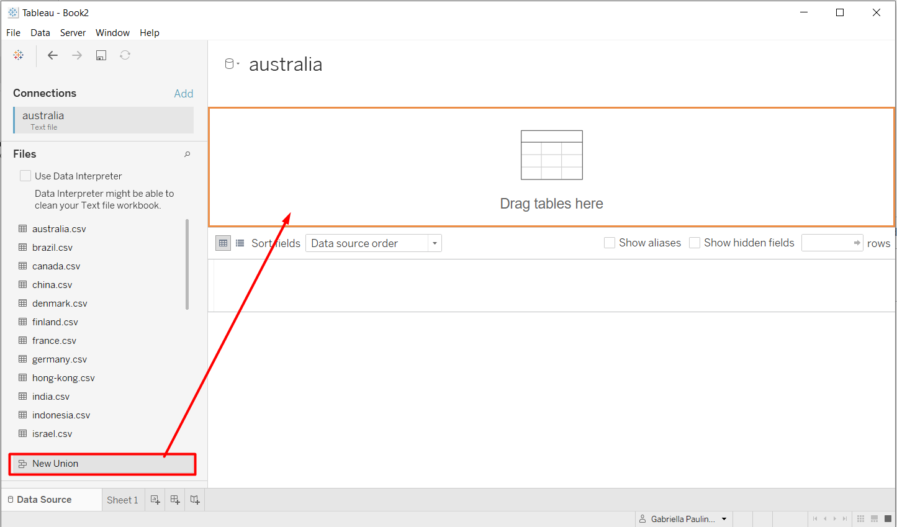

* **Drag New Union** to the workspace.

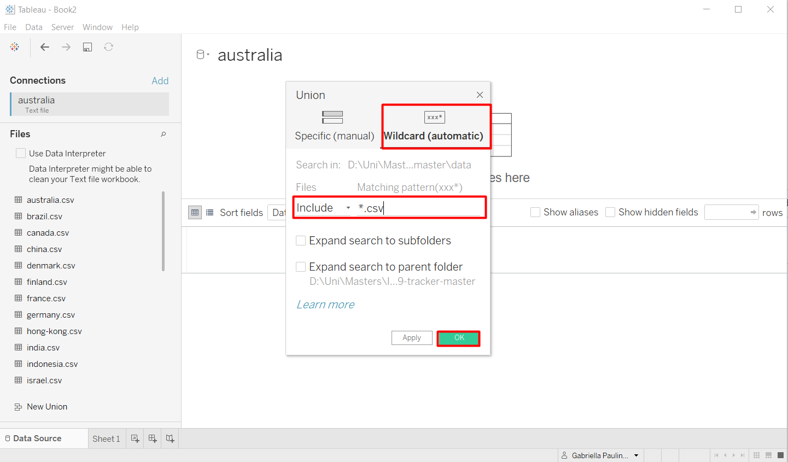

We can either drag all the tables listed in the Files column on the left or use the Wildcard tab. 

* Select **Wildcard (automatic)**.
* Enter the wildcard in **Include** field: **'\*.csv'**. This will include any files as long as they have '.csv' at the end of the file name. 
* Click **OK**.


Brace yourself, depending on your machine, the data cleaning part can take a long time for Tableau to process. **DO NOT CLICK UPDATE NOW or AUTOMATICALLY UPDATE**. Unless you want to stare at your Tableau and wait. 

To reduce the dataset, we need to hide away all columns we are not using and export the smaller set. Do keep in mind that we can still remove away more even after exporting, but we need to go through this process again if we want to add more columns.

* Hold **Ctrl** and **select the columns we want to remove**.
* **Right-click** > **Hide**.

We are interested in vac_1, vac2_1, vac2_2, vac2_3, vac2_6, and vac_3 survey items, as well as gender, age, household_size, household_children and employment_status contextual data.

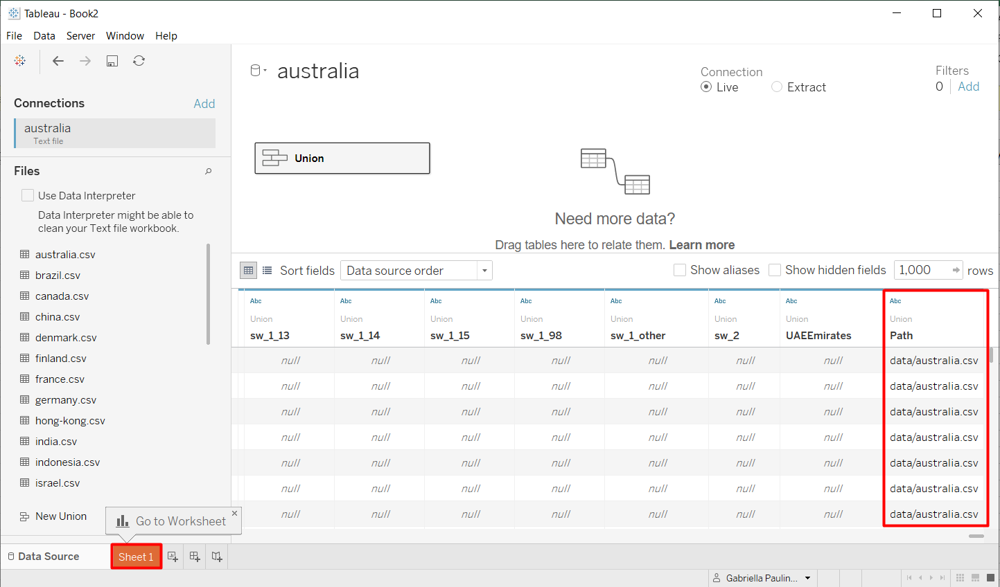

When we combine the files in a union, Tableau will add a column called Path or Table, depending on whether we used Wildcard or Specific method to add the files. We can rename and format this field, but it would be easier to do it later after we export the data subset.

* Go to Worksheet by clicking **Sheet 1**.

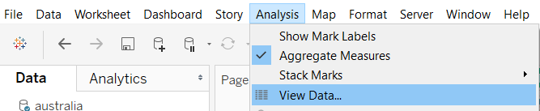

* Click on **Analysis** menu at the top of the screen > **View Data...**

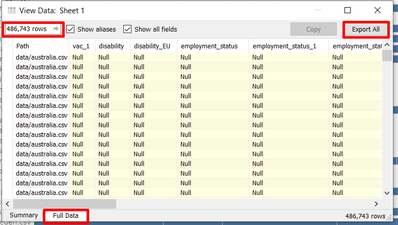

* Click on **Full Data**.
* By default, we only get the first 10,000 rows. Since we want to get all rows, enter a large number in the **number of rows**. I entered 1,000,000 and it automatically gets all the rows available, which is 486,743 rows.
* **Export all**.
* **Save the data**.

Now, we have a smaller dataset containing only the columns that we are interested in. Let's process the file in a new workbook. 

* **Ctrl + N**
* Repeat steps to **connect to the exported data**.

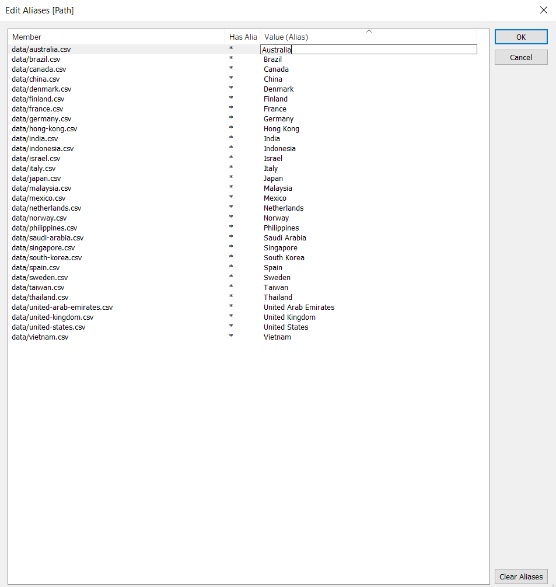

To improve the country name appearance, we are going to recode it.

* **Right-click** on **Path** column header > **Aliases...**
* Enter the appropriate **country name** in **Value(Alias)** column > **OK**.
* **Double-click** on 'Path' column name to **rename** the column to 'Country'.

The legend in the original visualisation is inconsistent because the survey item responses are stored in string, and only the value 1 and 5 have a descriptor for it. We are going to standardize the value as integer, so we need to get rid of the textual description by using a custom split. 

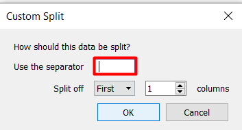

On each column there are 'Abc' or '#' symbol. 'Abc' means the column is a string, while '#' means it is numerical. If the symbol starts with an equal sign, such as '=Abc' or '=#', it means the column is a calculated field. Ensure that the survey items are in a string format before doing the split. If they are not, click on the data type and change it to String.

The value for 1 is '1 - Strongly Agree'. Notice that the numerical value is the first part of the string before a space bar. Therefore, we will split the first column using the space bar as a separator.

* **Right-click** on one of the survey items' column header (e.g. vac 1) > **Custom Split...**
* Enter a **space bar** in the **separator**
* Ensure we split off the **First 1 ** column > **OK**

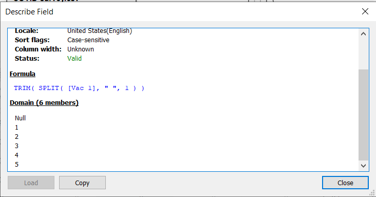

We can use describe field to check whether the split was done correctly.

* **Right-click** on the newly created column from the split > **Describe Field...**

We have the values from 1 to 5 now in the column, so we can convert the data type to number.

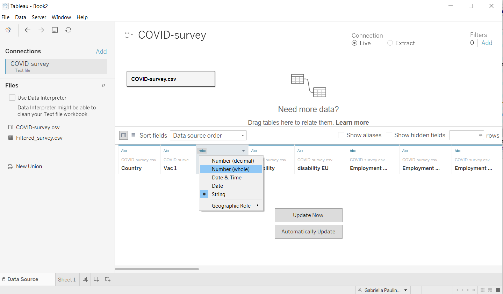


* Click on the **data type symbol** > **Number (whole)**

We can also rename the column and hide the original column to make it cleaner. I added a suffix '- ori' the original columns and used the original column names in the calculated columns.

**Repeat** the steps from Figure 13 for all survey items, and we are ready to create the visualisation.

## 4.2. Diverging Stacked Bar Chart
### Creating Visualisation
We will need make use of parameters to allow the users to dynamically change the survey items being displayed. 

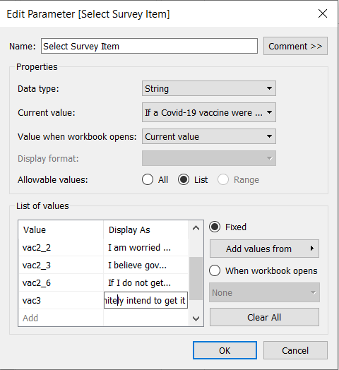

* Go to worksheet.
* **Right-click** on an empty space in the data pane > **Create Parameter...**. Tableau can be a bit picky about this, the 'Create Parameter' option does not show if you accidentally click on a field name. I found that the best place to click is just below the *Measure Values*.
* Enter **'Select Survey Item'** as **name** for the parameter.
* Change **data type** to **String**.
* Select **List** for allowable values.
* **Enter the list of values**. I used the column names (vac_1, vac2_1, vac2_2, vac2_3, vac2_6, and vac_3) for the value and the survey questions for the display as. Refer to [/covid-19-tracker/codebook.xlsx](https://github.com/YouGov-Data/covid-19-tracker/blob/master/codebook.xlsx) to get the survey questions.
* click **OK**.

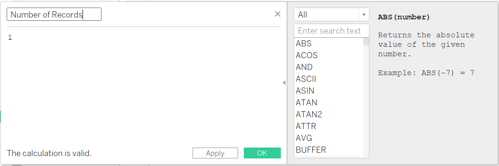

We will need several calculated fields to enable the visualisation. The steps to create a calculated fields are:
* **Right-click** on an empty space in the data pane > **Create Calculated Field...**.
* Enter the **field name** and the **formula**.

The formulas that we need for the diverging stacked bar chart are:

(@) **Number of Records**:

    1

(@) **Selected Survey Item**:

    CASE [Select Survey Item] 
when 'vac1' then [Vac 1]
when 'vac2_1' then [Vac2 1]
when 'vac2_2' then [Vac2 2]
when 'vac2_3' then [Vac2 3]
when 'vac2_6' then [Vac2 6]
when 'vac3' then [Vac 3]
end

(@) **Count Positive**:

    If [Selected_Survey_Item] < 3 then 1
elseif [Selected_Survey_Item] = 3 then 0.5
else 0
END

(@) **Count Negative**:

    If [Selected_Survey_Item] > 3 then -1
elseif [Selected_Survey_Item] = 3 then -0.5
else 0
END

(@) **Positive Percentage**:

    SUM([Count Positive]) /
TOTAL(SUM([Number of Records]))

(@) **Negative Percentage**:

    SUM([Count Negative]) /
TOTAL(SUM([Number of Records]))

We create the visualisation by adding fields to the rows and columns shelves, as well as the filters and marks cards. Figure 18 shows the first cut of the visualisation.

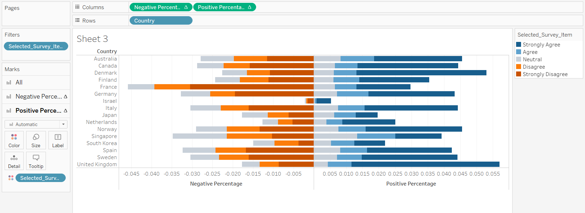

To get to this stage, the steps are:

** Drag **Negative Percentage** and **Positive Percentage** to Columns.
** Drag **Country** to Rows.
* We are not interested in the average or sum of the survey response, but we are going to treat is a category that describes the responses. Therefore, we need to convert it to a dimension by doing **right-click** on the **Selected_Survey_Item** field in the data pane > **Convert to Dimension**.
* Drag ** Drag **Negative Percentage** and **Positive Percentage** to Columns.
* Drag **Selected_Survey_Items** to **Color Marks Card**.
* Drag **Selected_Survey_Items** to **Filters Card** and select **All**, then **uncheck Null** to remove all null responses.

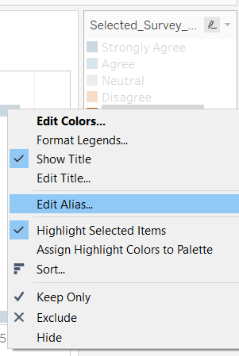

The visualisation is not completed yet, but I found it confusing to look at when the colour seem randomly chosen and the legend are not informative. We are going to stop a while to fix the legend before continuing.

* **Right-click** on the legend label > **Edit Alias...**. We know that 1 signifies 'Strongly Agree' while 5 stands for 'Strongly Disagree'. So we enter the descriptions accordingly for 2, 3, and 4 as well. 

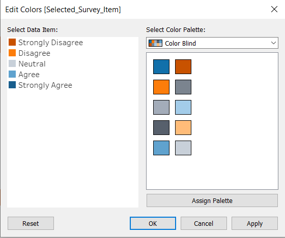

* **Double-click** on the colour legend to open the edit color window. 
* **Select the colours**. I used the **Color Blind** palette to ensure that the visualisation can be understood clearly, as ten percent of men has red-green colour-blindness [@shaffer]. **Shades of blue** colour are used to represent **positive** responses while **shades of red** are used to represent the **negative** sentiment. 

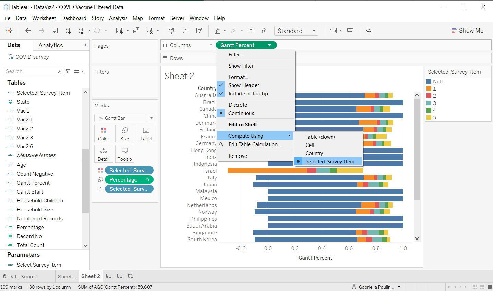

Notice that in Figure 18, the negative and positive percentage for each country do not add up to 100% and Israel has the smallest bar compared to other countries. To rectify this issue, ensure the percentages are computed based on the selected survey item.

* **Right-click** on **Negative Percentage** pill on the columns shelf > **Compute Using** > **Selected_Survey_Item**.
* **Repeat** for **Positive Percentage**.

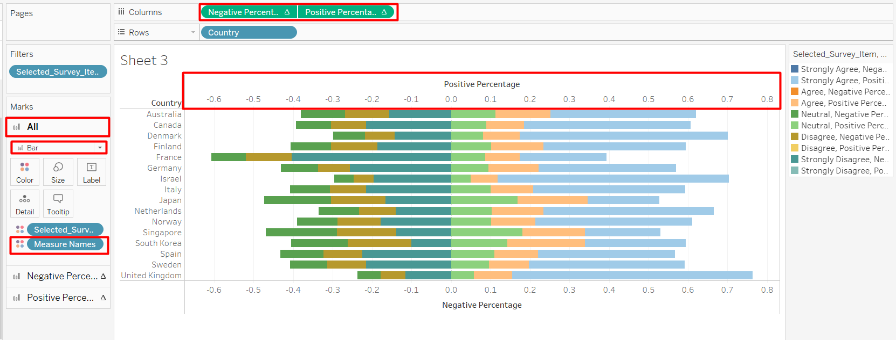

Although the percentages add up to 100% now, but they are actually plotting the positive and negative percentages side by side with a different axis scale. We will use dual axis to standardise the two axis. 

* **Right-click** on **Positive Percentage** pill on the column shelf > **Dual Axis**. 
* Don't panic if your visualisation suddenly goes haywire. Click **All Marks Card** then change the visualisation type from Automatic to **Bar**.
* **Right-click** on the **Positive Percentage Axis** > **Synchronize Axis**.
* We can get back the original colour we have chosen by removing the Measure Names from the colour marks card. We can **drag** the **Measure Names** field **off from the Marks Card**. Ensure we are still selecting the All Marks Card while doing so.

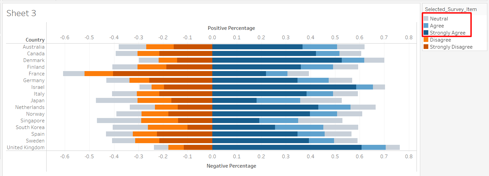

Previously, neutral bars are drawn first for the Positive Percentage. We can rearrange the bars by manually reordering the colour in the colour legend.

* **Drag Neutral** colour to the top.
* **Swap** the order between **Strongly Agree** and Agree.

This creates an unintuitive order for the colour legend, but it is fine. We will not use this legend in the final dashboard. 

### Customisation

We can do some final touch up to customise how our visualisation looks like. For a more detailed steps to change each of the elements, take a look at my [first dataviz makeover post](https://gabriellapauline.netlify.app/dataviz/2021-01-29-dataviz-makeover-1/#step-by-step-description). 

#### Axis


For the axis, we are going edit the title and format the numbers.

* **Right-click** on the **Negative Percentage axis** > **Edit Axis...**
* Change the **Title** to **Proportion**.
* Remove the top axis by doing **right-click** on the **Positive Percentage axis** > **uncheck Show Header**

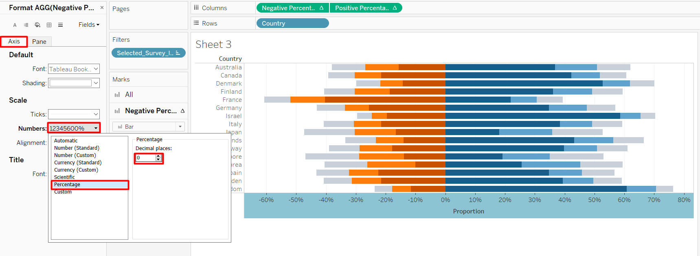

* * **Right-click** on the **axis** > **Format...**
* Click **Axis** > **Numbers** > **Percentage**.
* Use **0 decimal points**.
* Repeat for the top axis. I chose to leave it inside instead of removing it because it might be easier to see since we have numerous countries. 

#### Title
Remember the parameter we created earlier? We are going to use the questions as the title. 

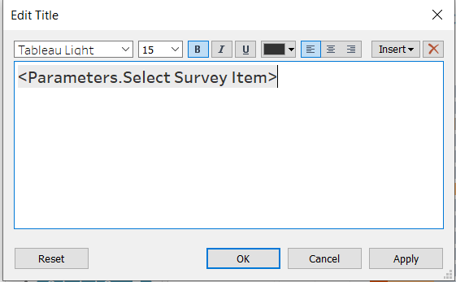 

* **Double-click** on the **title**.
* **Insert** > **Parameters.SelectSurveyItem** > **OK**.
* We can show the parameter to check. Go to the data pane, **right-click** on the **Select Survey Item** > **Show Parameter**. We can toggle the different survey items we want to see and the visualisation will change accordingly.

#### Filters
Having filters allow the users to interact with the visualisation and tailor it according to their needs. We will use Employment Status, Gender, Household Children and Household Size fields as the filters.

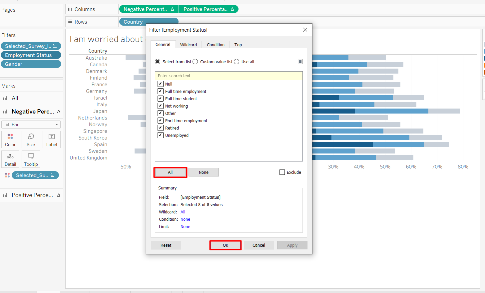

* **Drag Employment Status** to the **Filters**.
* Click **All** > **OK**.
* **Right-click** on the **Employment Status** pill in the filter card > **Show Filter**.
* **Repeat** for **Gender**.

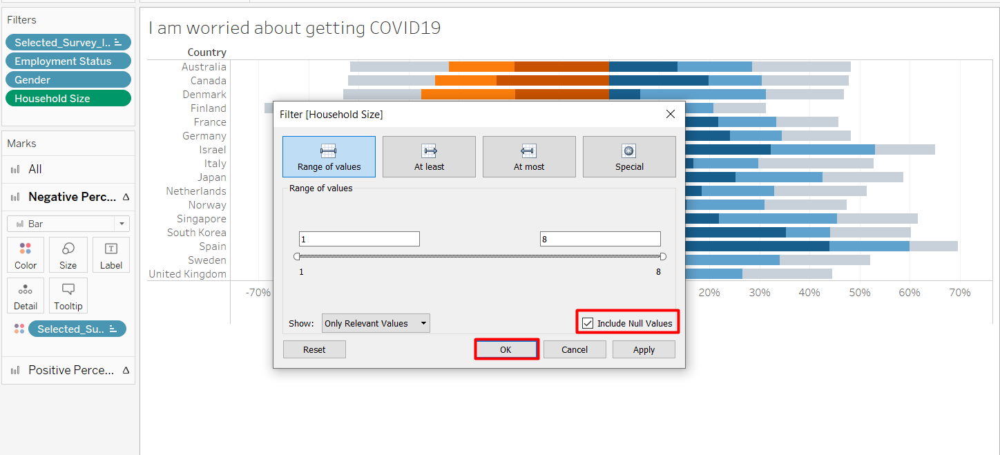

For the numeric filter, the interface is slightly different because we can pick a range of values.

* **Drag Household Size** to the **Filters**.
* **All values** > **Next**.
* Check **include null values** > **OK**. This might dilute the information because the nulls will still be included when we want to examine by a certain household size, but filtering out the nulls can cause us to lose a significant subset of data. For this trade-off, I chose to include the nulls.
* **Right-click** on the **Household Size** pill in the filter card > **Show Filter**.
* **Repeat** for **Household Children**.

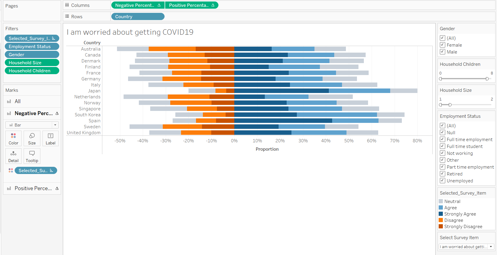

One down, one more to go!


