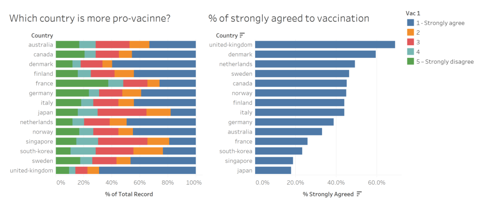

```{r setup, include=FALSE}
knitr::opts_chunk$set(echo = FALSE)
```

# 1. Introduction
COVID pandemic has impacted the world in unimaginable ways: work from home and zoom meetings are becoming norms; overseas travel almost comes to a complete halt; we might even start to forget that COVID confirmed cases and death are human beings, and not just numbers in a statistics. For the pandemic to be over, we need to achieve herd immunity either through recovery from infection or vaccine [@charumilind_craven_lamb_sabow_wilson_2021]. However, despite being eager of seeing the end to this calamity, people might also have worries and beliefs that make them hesitant to take the vaccine. 

Imperial College London Big Data Analytical Unit and YouGov [@jones_sarah_2020] conducted a survey that measures the people's behaviours in response to COVID-19. This data visualisation makeover will focus on the willingness of people in various countries to take the COVID vaccine.


# 2. Original Visualisation Evaluation
To start, we examine the original visualisation from the data (Figure 1) to learn what we can improve. The critiques are given in terms of **clarity** and **aesthetics**.



## 2.1 Clarity
### To keep:
   1. The countries graphs are shown in a **sorted order**. The left graph is shown in alphabetical order, while the right graph is shown in a descending order.
   1. The **usage of colour is consistent** between the two graphs. Both uses blue colour for strongly agree.
   1. The **axes and gridlines help the users to compare the values**.
   
### To be improved:
   1. Although the Likert Scale data is ordinal, the **choice of colour does not show an inherent order**. It would be better if a diverging colour scale is used, because the data has a meaningful central value, which is the neutral opinion [@yi_2019].
   1. Because the survey is conducted on a sample of the population, the actual proportion in the population might not be exactly the same. **Not visualising the uncertainty** can mislead the users, and thus we need to show the range of possible values [@torres_2016]. 
   1. It is **hard to compare the actual proportion of people who picked 2, 3, or 4 in the Likert Scale** because they do not have a common baseline.
   1. The **order of the countries are inconsistent** between the two graphs.
   1. The **title of the legend is not informative**.
   
## 2.2 Aesthetics
### To keep:
   1. The chart has a nice **font selection** that is easy to read and not unnecessarily embellished.
   1. The **number of tick marks is just nice** to allow comparison but not overly clutter the visualisation.
   1. The two **graphs are properly aligned**.
   1. **Labels have less colour intensity** so they do not distract the users.
  
### To be improved:
   1. The **choice of colours is too reliant on hue variation** instead of value or chroma, hence increasing the visual clutter [@Stone2006ChoosingCF]. It is better to limit the colour palette to 2 or 3 hues and use variation of colour intensity to make the visualisation more aesthetically pleasing and functional.
   1. **Country names are not formatted properly**. There is no capitalisation and there are dashes in the names.
   1. **Decimal points are inconsistent in the axes**. The left graph has no decimal points but the right one has 1 decimal points.
   1. **Labels of the colour legend are inconsistent**. Value 1 and 5 have a text explanation, while 2, 3, and 4 are just numbers.

# 3. Alternative Graphical Representation
Figure 2 shows the alternative graphical representation proposed for the makeover.


The issues that the alternative design tries to overcome is colour-coded, with orange numbers corresponding to critiques for clarity and blue numbers for critiques with regards to aesthetics.

### Clarity:
   1. To show an order in the survey response using a **diverging colour scale**.
   1. To show the uncertainty using an **error bar** in the breakdown chart.
   1. To **allow the users to toggle between different response of interest**. The users may choose to view individual percentage and error bars for 'Strongly Agree', 'Agree', 'Neutral', 'Disagree', and 'Strongly Disagree'.
   1. To **sort the order of countries in both graphs consistently** in descending manner according to the selected response of interest in the right graph.
   
### Aesthetics:
   1. To **limit the colour palette** and utilise a variation of colour intensity on top of differing hue.
   1. To use **proper capitalisation and formatting for the country name** labels.
   1. To **standardise the axes labels to show no decimal points**.
   1. To **label the colour legends consistently using a textual explanation**.
   
### Additional Features:
   1. To **allow the users to visualise different survey items**. The users can see the response for questions such as whether the respondents are afraid of COVID vaccine side effects, not just restricted to whether or not they are willing to take the vaccine.
   1. To **use animation to show the transitions** between different selected parameters, so the users can easily notice if the ranks of the countries change.
   
The final look of the data visualisation makeover is shown in Figure 3. It is also available in **!!!!**


# 4. Step-by-Step Description
In this section, we are going through the steps to recreate the Data Visualisation Makeover shown in Figure 3 using Tableau. Tableau Desktop has a 14-day trial that can be downloaded [here](https://www.tableau.com/products/desktop/download). 

## 4.1 Data Preparation
### Data Source
The visualisation is based on the publicly available [Imperial College London YouGov Covid 19 Behaviour Tracker Data Hub](https://github.com/YouGov-Data/covid-19-tracker), which aims to get insights or how people respond to COVID-19. They also publish a [dashboard](https://ichpanalytics.imperialcollegehealthpartners.com/t/BDAU/views/YouGovICLCOVID-19BehaviourTracker/Homepage) to visualise the data.

### Data Cleaning
As the survey was done in a large scale and measures a wide variety of behavioural responses, there are a lot of columns that we do not need. Reducing the size of the dataset is necessary to speed up Tableau, and ensure we do not drown in the data ;)


* Create a **New Workbook**.
* Click **Connect to Data**.
* Select the **data type** and browse to **select any one of the csv** (The data comes in multiple csv files, one for each country).


Next, we need to join all the files using the Union function from Tableau. Ensure the workspace has no tables to prevent errors when we join the csv files.

* **Right-click** on the **table** > **Remove**.


* **Drag New Union** to the workspace.


We can either drag all the tables listed in the Files column on the left or use the Wildcard tab. 

* Select **Wildcard (automatic)**.
* Enter the wildcard in **Include** field: **'\*.csv'**. This will include any files as long as they have '.csv' at the end of the file name. 


Brace yourself, depending on your machine, the data cleaning part can take a long time for Tableau to process. **DO NOT CLICK UPDATE NOW or AUTOMATICALLY UPDATE**. Unless you want to stare at your Tableau and wait. 

To reduce the dataset, we need to hide away all columns we are not using and export the smaller set. Do keep in mind that we can still remove away more even after exporting, but we need to go through this process again if we want to add more columns.

* Hold **Ctrl** and **select the columns we want to remove**.
* **Right-click** > **Hide**.

We are interested in vac_1, vac2_1, vac2_2, vac2_3, vac2_6, and vac_3 survey items, as well as gender, age, household_size, household_children and employment_status contextual data.


