```{r setup, include=FALSE}
knitr::opts_chunk$set(echo = FALSE)
```

# 1. Introduction
COVID pandemic has impacted the world in unimaginable ways: work from home and zoom meetings are becoming norms; overseas travel almost comes to a complete halt; we might even start to forget that COVID confirmed cases and death are human beings, and not just numbers in a statistics. For the pandemic to be over, we need to achieve herd immunity either through recovery from infection or vaccine [@charumilind_craven_lamb_sabow_wilson_2021]. However, despite being eager of seeing the end to this calamity, people might also have worries and beliefs that make them hesitant to take the vaccine. 

Imperial College London Big Data Analytical Unit and YouGov [@jones_sarah_2020] conducted a survey that measures the people's behaviours in response to COVID-19. This data visualisation makeover will focus on the willingness of people in various countries to take the COVID vaccine.


# 2. Original Visualisation Evaluation
To start, we examine the original visualisation from the data (Figure 1) to learn what we can improve. The critiques are given in terms of **clarity** and **aesthetics**.


## 2.1 Clarity
### To keep:
   1. The countries graphs are shown in a **sorted order**. The left graph is shown in alphabetical order, while the right graph is shown in a descending order.
   1. The **usage of colour is consistent** between the two graphs. Both uses blue colour for strongly agree.
   1. The **axes and gridlines help the users to compare the values**.
   
### To be improved:
   1. Although the Likert Scale data is ordinal, the **choice of colour does not show an inherent order**. It would be better if a diverging colour scale is used, because the data has a meaningful central value, which is the neutral opinion [@yi_2019].
   1. Because the survey is conducted on a sample of the population, the actual proportion in the population might not be exactly the same. **Not visualising the uncertainty** can mislead the users, and thus we need to show the range of possible values [@torres_2016]. 
   1. It is **hard to compare the actual proportion of people who picked 2, 3, or 4 in the Likert Scale** because they do not have a common baseline.
   1. The **order of the countries are inconsistent** between the two graphs.
   1. The **title of the legend is not informative**.
   
## 2.2 Aesthetics
### To keep:
   1. The chart has a nice **font selection** that is easy to read and not unnecessarily embellished.
   1. The **number of tick marks is just nice** to allow comparison but not overly clutter the visualisation.
   1. The two **graphs are properly aligned**.
   1. **Labels have less colour intensity** so they do not distract the users.
  
### To be improved:
   1. The **choice of colours is too reliant on hue variation** instead of value or chroma, hence increasing the visual clutter [@Stone2006ChoosingCF]. It is better to limit the colour palette to 2 or 3 hues and use variation of colour intensity to make the visualisation more aesthetically pleasing and functional.
   1. **Country names are not formatted properly**. There is no capitalisation and there are dashes in the names.
   1. **Decimal points are inconsistent in the axes**. The left graph has no decimal points but the right one has 1 decimal points.
   1. **Labels of the colour legend are inconsistent**. Value 1 and 5 have a text explanation, while 2, 3, and 4 are just numbers.

# 3. Alternative Graphical Representation
Figure 2 shows the alternative graphical representation proposed for the makeover.

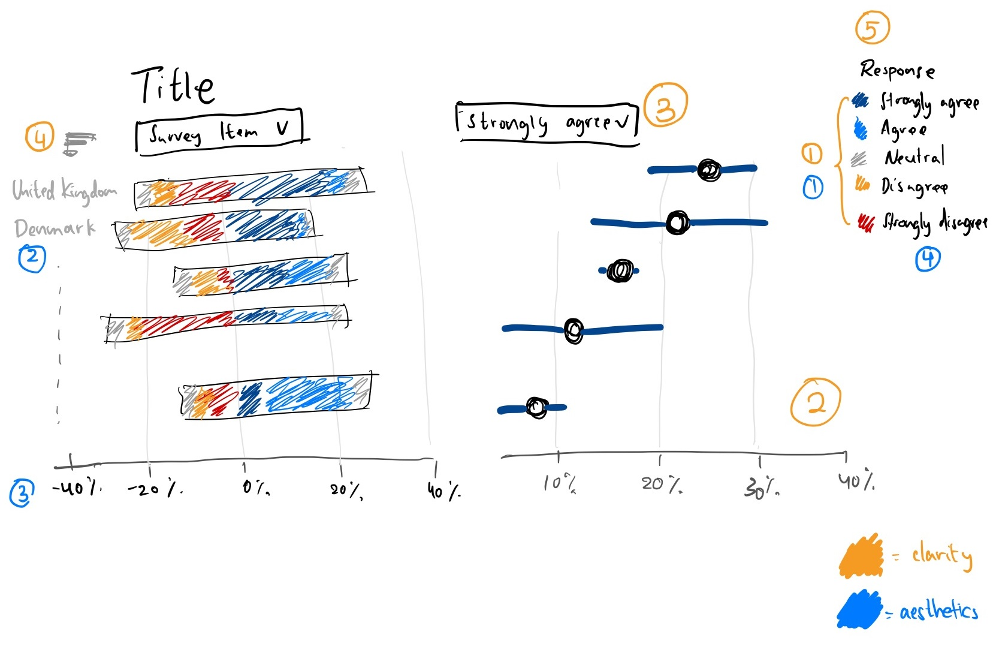

The survey data uses a 5-point Likert scale for the respondents to rate the statements. There are multiple ways to visualise Likert scale data, such as a 100% stacked bar chart as in the original visualisation, multiple pie charts, diverging stacked bar chart, and so on [@pirrone_2020].

Diverging stacked bar chart will help to compare the positive and negative sentiment more clearly, but there are multiple views of how to categorise neutral opinion. Having the middle of the neutral proportion as the center line makes it hard to compare the values because there is no common baseline [@wexler_2020]. Therefore, the first part of the alternative design is a diverging stacked bar chart, in which we will split the neutral opinion and put it at the outermost part of the stacked bar.

The second part of the alternative design is a dot plot with error bar that indicates the confidence interval of the proportion. This will show the underlying variation in the data and prevent misleading the users [@wexler_2018]. 

The issues from the original visualisation that the alternative design tries to overcome is colour-coded in Figure 2, with orange numbers corresponding to critiques for clarity and blue numbers for critiques with regards to aesthetics.

### Clarity:
   1. To show an order in the survey response using a **diverging colour scale**.
   1. To show the uncertainty using an **error bar** in the dot plot.
   1. To **allow the users to toggle between different response of interest**. The users may choose to view individual percentage and error bars for 'Strongly Agree', 'Agree', 'Neutral', 'Disagree', and 'Strongly Disagree'.
   1. To **sort the order of countries in both graphs consistently** in descending manner according to the selected response of interest in the right graph.
   
### Aesthetics:
   1. To **limit the colour palette** and utilise a variation of colour intensity on top of differing hue.
   1. To use **proper capitalisation and formatting for the country name** labels.
   1. To **standardise the axes labels to show no decimal points**.
   1. To **label the colour legends consistently using a textual explanation**.
   
### Additional Features:
   1. To **allow the users to visualise different survey items**. The users can see the response for questions such as whether the respondents are afraid of COVID vaccine side effects, not just restricted to whether or not they are willing to take the vaccine.
   1. To **use animation to show the transitions** between different selected parameters, so the users can easily notice if the ranks of the countries change.
   
The final look of the data visualisation makeover is shown in Figure 3. It is also available in **!!!!**

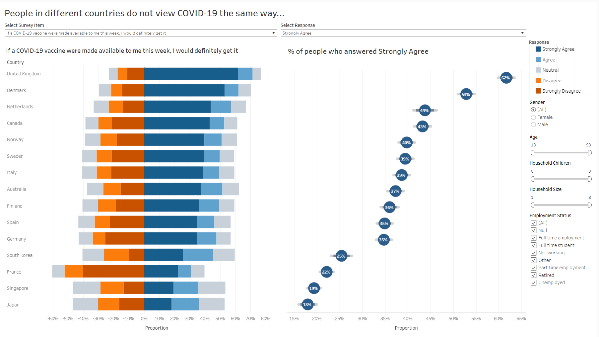

# 4. Step-by-Step Description
In this section, we are going through the steps to recreate the Data Visualisation Makeover shown in Figure 3 using Tableau. Tableau Desktop has a 14-day trial that can be downloaded [here](https://www.tableau.com/products/desktop/download). 

## 4.1. Data Preparation
### Data Source
The visualisation is based on the publicly available [Imperial College London YouGov Covid 19 Behaviour Tracker Data Hub](https://github.com/YouGov-Data/covid-19-tracker), which aims to get insights or how people respond to COVID-19. They also publish a [dashboard](https://ichpanalytics.imperialcollegehealthpartners.com/t/BDAU/views/YouGovICLCOVID-19BehaviourTracker/Homepage) to visualise the data.

### Data Cleaning
As the survey was done in a large scale and measures a wide variety of behavioural responses, there are a lot of columns that we do not need. Reducing the size of the dataset is necessary to speed up Tableau, and ensure we do not drown in the data ;)


* Create a **New Workbook**.
* Click **Connect to Data**.
* Select the **data type** and browse to **select any one of the csv** (The data comes in multiple csv files, one for each country).

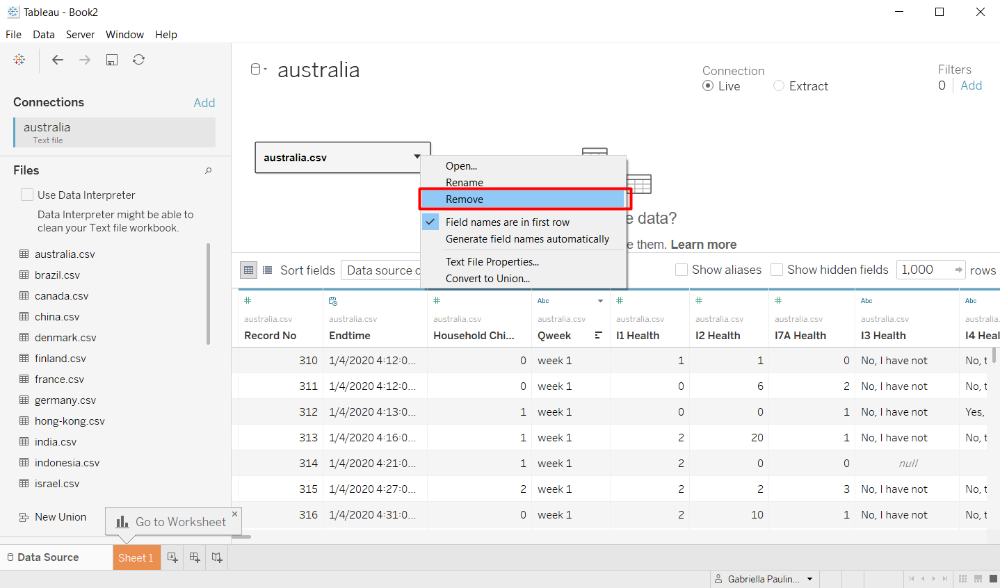

Next, we need to join all the files using the Union function from Tableau. Ensure the workspace has no tables to prevent errors when we join the csv files.

* **Right-click** on the **table** > **Remove**.


* **Drag New Union** to the workspace.


We can either drag all the tables listed in the Files column on the left or use the Wildcard tab. 

* Select **Wildcard (automatic)**.
* Enter the wildcard in **Include** field: **'\*.csv'**. This will include any files as long as they have '.csv' at the end of the file name. 
* Click **OK**.

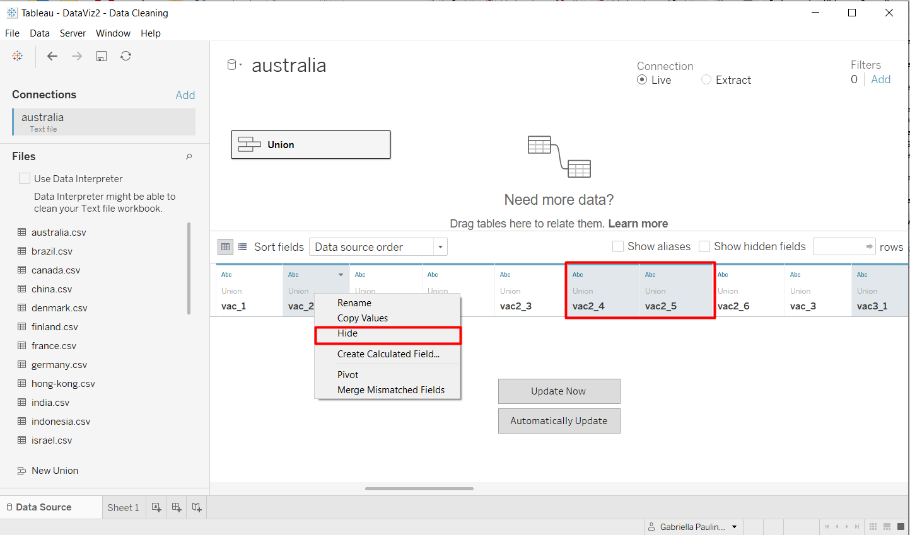

Brace yourself, depending on your machine, the data cleaning part can take a long time for Tableau to process. **DO NOT CLICK UPDATE NOW or AUTOMATICALLY UPDATE**. Unless you want to stare at your Tableau and wait. 

To reduce the dataset, we need to hide away all columns we are not using and export the smaller set. Do keep in mind that we can still remove away more even after exporting, but we need to go through this process again if we want to add more columns.

* Hold **Ctrl** and **select the columns we want to remove**.
* **Right-click** > **Hide**.

We are interested in vac_1, vac2_1, vac2_2, vac2_3, vac2_6, and vac_3 survey items, as well as gender, age, household_size, household_children and employment_status contextual data.

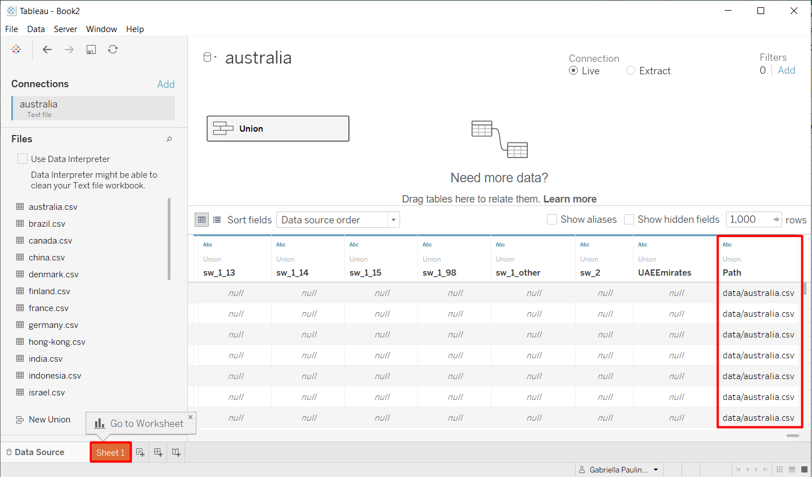

When we combine the files in a union, Tableau will add a column called Path or Table, depending on whether we used Wildcard or Specific method to add the files. We can rename and format this field, but it would be easier to do it later after we export the data subset.

* Go to Worksheet by clicking **Sheet 1**.

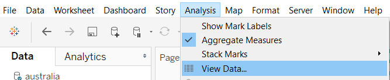

* Click on **Analysis** menu at the top of the screen > **View Data...**

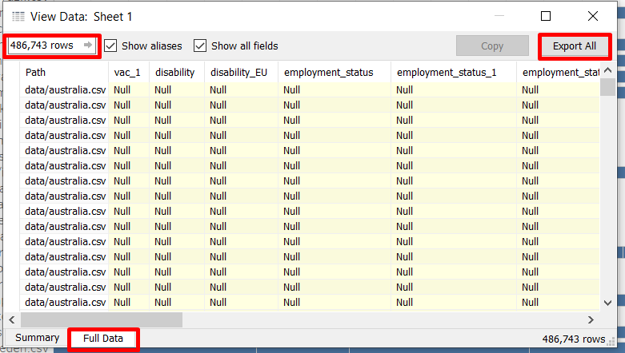

* Click on **Full Data**.
* By default, we only get the first 10,000 rows. Since we want to get all rows, enter a large number in the **number of rows**. I entered 1,000,000 and it automatically gets all the rows available, which is 486,743 rows.
* **Export all**.
* **Save the data**.

Now, we have a smaller dataset containing only the columns that we are interested in. Let's process the file in a new workbook. 

* **Ctrl + N**
* Repeat steps to **connect to the exported data**.

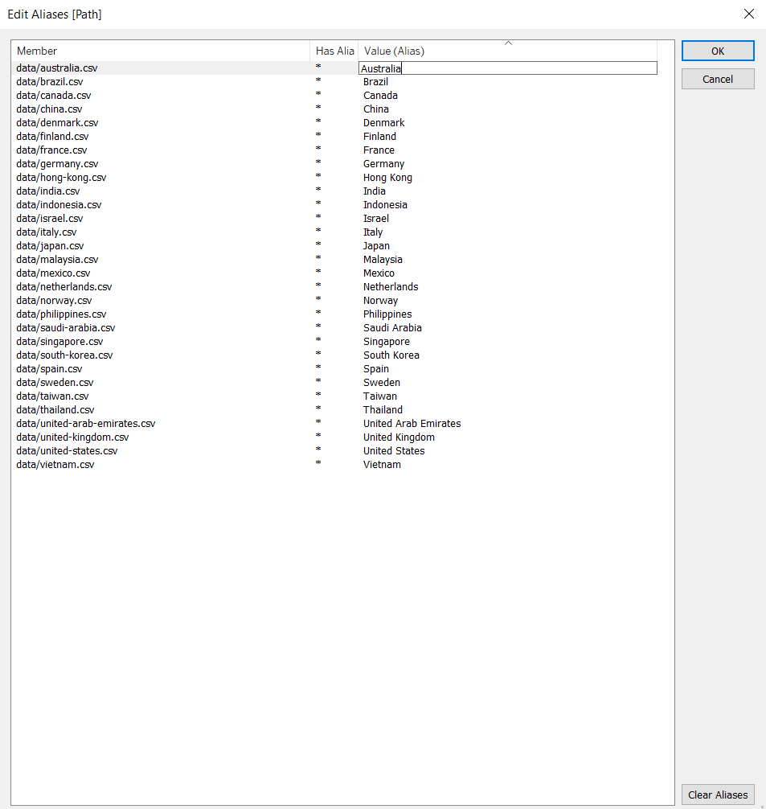

To improve the country name appearance, we are going to recode it.

* **Right-click** on **Path** column header > **Aliases...**
* Enter the appropriate **country name** in **Value(Alias)** column > **OK**.
* **Double-click** on 'Path' column name to **rename** the column to 'Country'.

The legend in the original visualisation is inconsistent because the survey item responses are stored in string, and only the value 1 and 5 have a descriptor for it. We are going to standardize the value as integer, so we need to get rid of the textual description by using a custom split. 

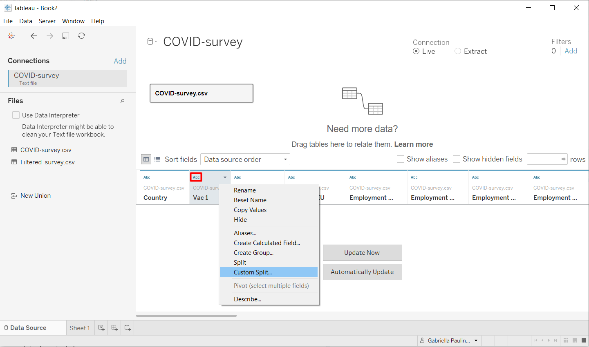

On each column there are 'Abc' or '#' symbol. 'Abc' means the column is a string, while '#' means it is numerical. If the symbol starts with an equal sign, such as '=Abc' or '=#', it means the column is a calculated field. Ensure that the survey items are in a string format before doing the split. If they are not, click on the data type and change it to String.

The value for 1 is '1 - Strongly Agree'. Notice that the numerical value is the first part of the string before a space bar. Therefore, we will split the first column using the space bar as a separator.

* **Right-click** on one of the survey items' column header (e.g. vac 1) > **Custom Split...**
* Enter a **space bar** in the **separator**
* Ensure we split off the **First 1 ** column > **OK**

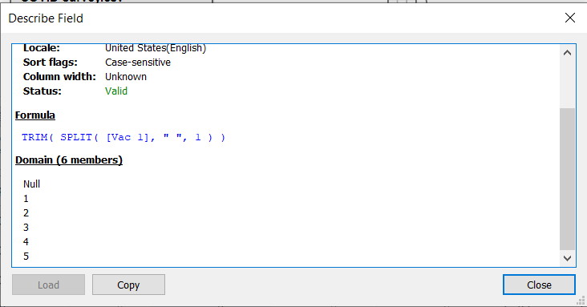

We can use describe field to check whether the split was done correctly.

* **Right-click** on the newly created column from the split > **Describe Field...**

We have the values from 1 to 5 now in the column, so we can convert the data type to number.

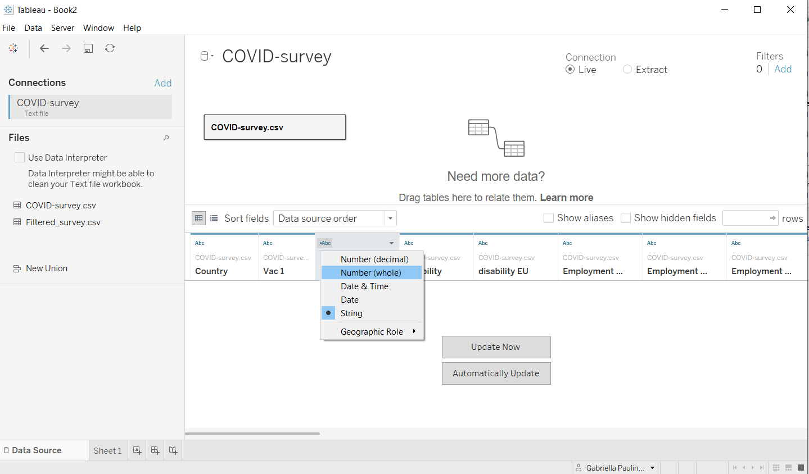


* Click on the **data type symbol** > **Number (whole)**

We can also rename the column and hide the original column to make it cleaner. I added a suffix '- ori' the original columns and used the original column names in the calculated columns.

**Repeat** the steps from Figure 13 for all survey items, and we are ready to create the visualisation.

## 4.2. Diverging Stacked Bar Chart
### Creating Visualisation
We will need make use of parameters to allow the users to dynamically change the survey items being displayed. 

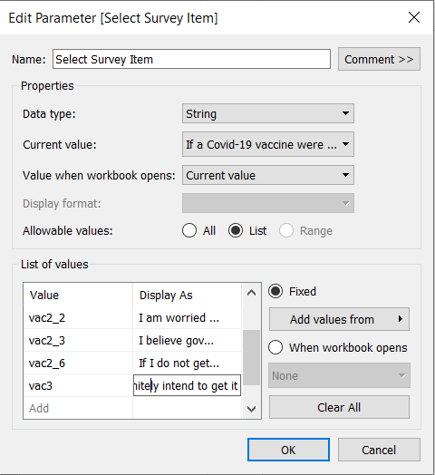

* Go to worksheet.
* **Right-click** on an empty space in the data pane > **Create Parameter...**. Tableau can be a bit picky about this, the 'Create Parameter' option does not show if you accidentally click on a field name. I found that the best place to click is just below the *Measure Values*.
* Enter **'Select Survey Item'** as **name** for the parameter.
* Change **data type** to **String**.
* Select **List** for allowable values.
* **Enter the list of values**. I used the column names (vac_1, vac2_1, vac2_2, vac2_3, vac2_6, and vac_3) for the value and the survey questions for the display as. Refer to [/covid-19-tracker/codebook.xlsx](https://github.com/YouGov-Data/covid-19-tracker/blob/master/codebook.xlsx) to get the survey questions.
* click **OK**.

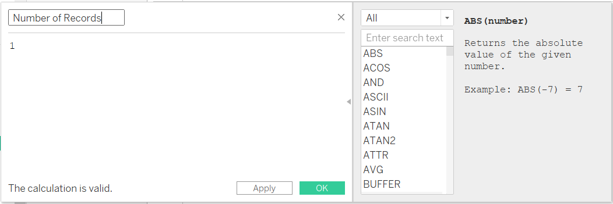

We will need several calculated fields to enable the visualisation. The steps to create a calculated fields are:
* **Right-click** on an empty space in the data pane > **Create Calculated Field...**.
* Enter the **field name** and the **formula**.

The formulas that we need for the diverging stacked bar chart are:

(@) **Number of Records**:

    1

(@) **Selected Survey Item**:

    CASE [Select Survey Item] 
when 'vac1' then [Vac 1]
when 'vac2_1' then [Vac2 1]
when 'vac2_2' then [Vac2 2]
when 'vac2_3' then [Vac2 3]
when 'vac2_6' then [Vac2 6]
when 'vac3' then [Vac 3]
end

(@) **Count Positive**:

    If [Selected_Survey_Item] < 3 then 1
elseif [Selected_Survey_Item] = 3 then 0.5
else 0
END

(@) **Count Negative**:

    If [Selected_Survey_Item] > 3 then -1
elseif [Selected_Survey_Item] = 3 then -0.5
else 0
END

(@) **Total Count**:
    TOTAL(SUM([Number of Records]))

(@) **Positive Percentage**:

    SUM([Count Positive]) / [Total Count]

(@) **Negative Percentage**:

    SUM([Count Negative]) / [Total Count]

We create the visualisation by adding fields to the rows and columns shelves, as well as the filters and marks cards. Figure 18 shows the first cut of the visualisation.

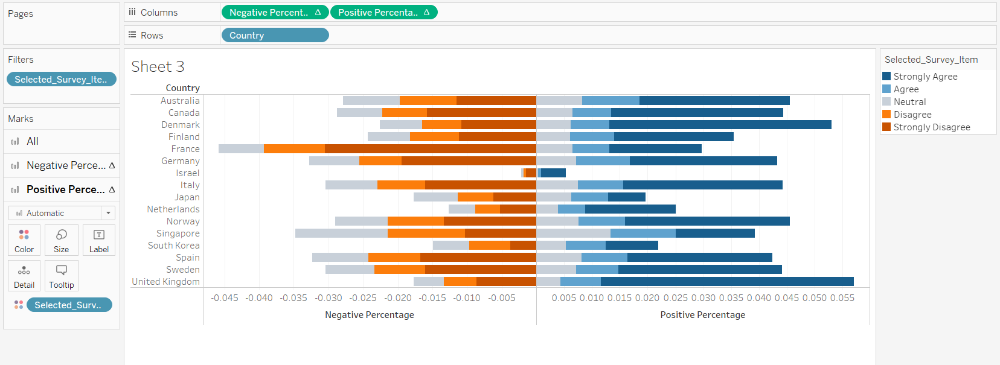

To get to this stage, the steps are:

** Drag **Negative Percentage** and **Positive Percentage** to Columns.
** Drag **Country** to Rows.
* We are not interested in the average or sum of the survey response, but we are going to treat is a category that describes the responses. Therefore, we need to convert it to a dimension by doing **right-click** on the **Selected_Survey_Item** field in the data pane > **Convert to Dimension**.
* Drag ** Drag **Negative Percentage** and **Positive Percentage** to Columns.
* Drag **Selected_Survey_Items** to **Color Marks Card**.
* Drag **Selected_Survey_Items** to **Filters Card** and select **All**, then **uncheck Null** to remove all null responses.


The visualisation is not completed yet, but I found it confusing to look at when the colour seem randomly chosen and the legend are not informative. We are going to stop a while to fix the legend before continuing.

* **Right-click** on the legend label > **Edit Alias...**. We know that 1 signifies 'Strongly Agree' while 5 stands for 'Strongly Disagree'. So we enter the descriptions accordingly for 2, 3, and 4 as well. 

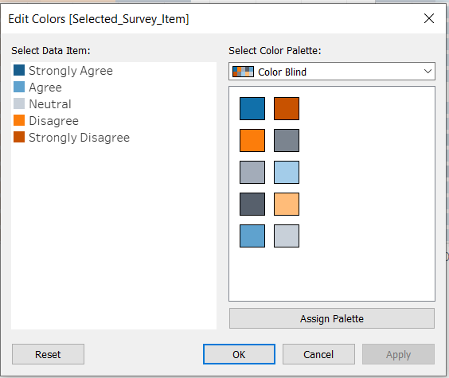

* **Double-click** on the colour legend to open the edit color window. 
* **Select the colours**. I used the **Color Blind** palette to ensure that the visualisation can be understood clearly, as ten percent of men has red-green colour-blindness [@shaffer]. **Shades of blue** colour are used to represent **positive** responses while **shades of red** are used to represent the **negative** sentiment. 

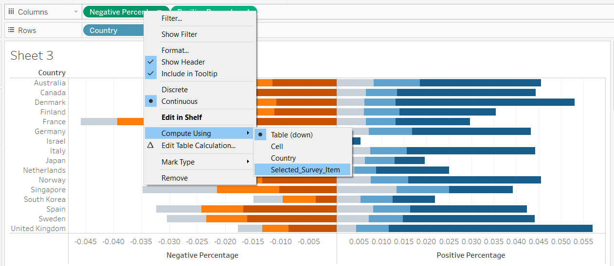

Notice that in Figure 18, the negative and positive percentage for each country do not add up to 100% and Israel has the smallest bar compared to other countries. To rectify this issue, ensure the percentages are computed based on the selected survey item.

* **Right-click** on **Negative Percentage** pill on the columns shelf > **Compute Using** > **Selected_Survey_Item**.
* **Repeat** for **Positive Percentage**.

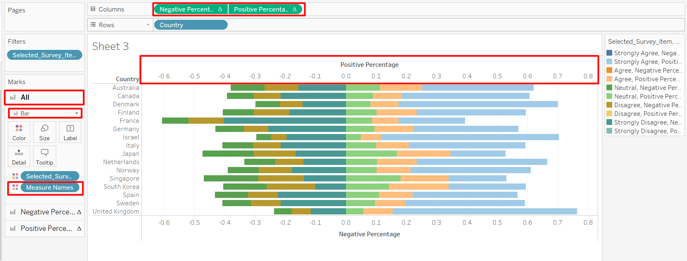

Although the percentages add up to 100% now, but they are actually plotting the positive and negative percentages side by side with a different axis scale. We will use dual axis to standardise the two axis. 

* **Right-click** on **Positive Percentage** pill on the column shelf > **Dual Axis**. 
* Don't panic if your visualisation suddenly goes haywire. Click **All Marks Card** then change the visualisation type from Automatic to **Bar**.
* **Right-click** on the **Positive Percentage Axis** > **Synchronize Axis**.
* We can get back the original colour we have chosen by removing the Measure Names from the colour marks card. We can **drag** the **Measure Names** field **off from the Marks Card**. Ensure we are still selecting the All Marks Card while doing so.

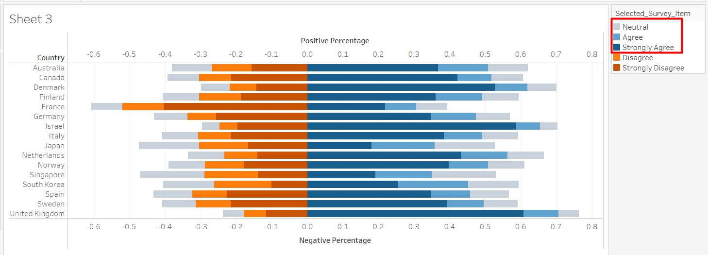

Previously, neutral bars are drawn first for the Positive Percentage. We can rearrange the bars by manually reordering the colour in the colour legend.

* **Drag Neutral** colour to the top.
* **Swap** the order between **Strongly Agree** and Agree.

This creates an unintuitive order for the colour legend, but it is fine. We will not use this legend in the final dashboard. 

### Customisation

We can do some final touch up to customise how our visualisation looks like. For a more detailed steps to change each of the elements, take a look at my [first dataviz makeover post](https://gabriellapauline.netlify.app/dataviz/2021-01-29-dataviz-makeover-1/#step-by-step-description). 

#### Axis

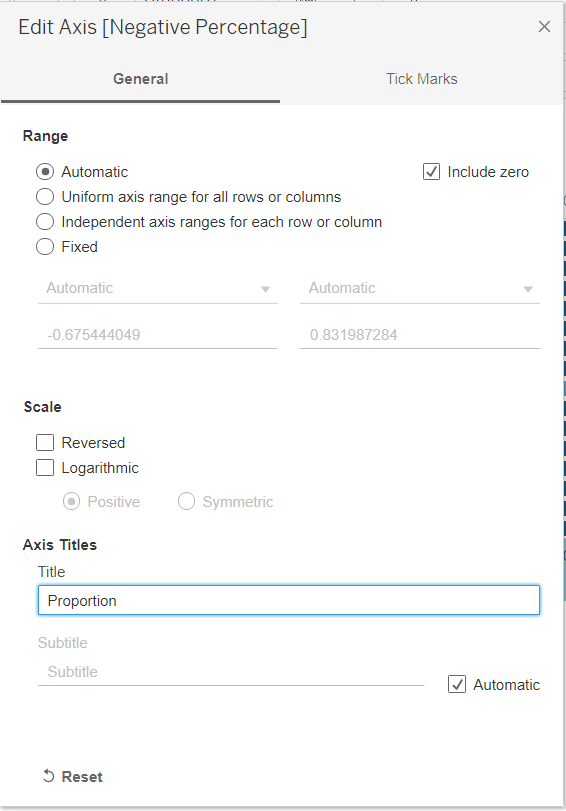

For the axis, we are going edit the title and format the numbers.

* **Right-click** on the **Negative Percentage axis** > **Edit Axis...**
* Change the **Title** to **Proportion**.
* Remove the top axis by doing **right-click** on the **Positive Percentage axis** > **uncheck Show Header**

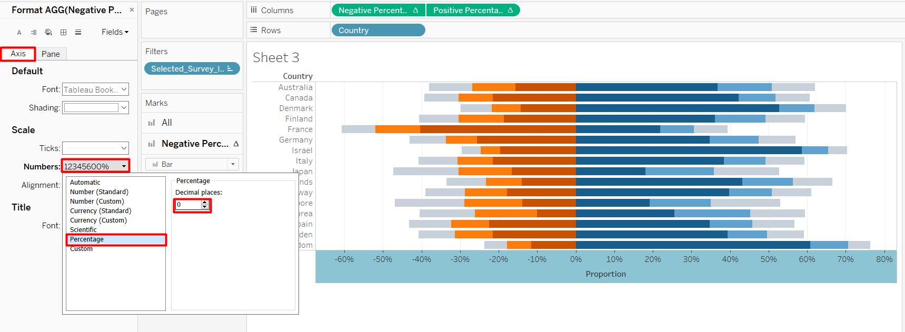

* * **Right-click** on the **axis** > **Format...**
* Click **Axis** > **Numbers** > **Percentage**.
* Use **0 decimal points**.
* Repeat for the top axis. I chose to leave it inside instead of removing it because it might be easier to see since we have numerous countries. 

#### Title
Remember the parameter we created earlier? We are going to use the questions as the title. 

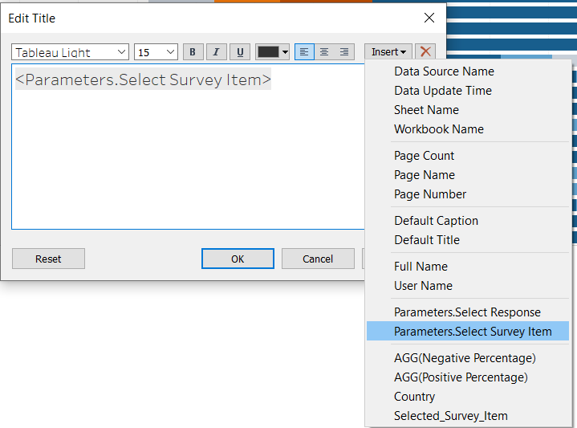 

* **Double-click** on the **title**.
* **Insert** > **Parameters.SelectSurveyItem** > **OK**.
* We can show the parameter to check. Go to the data pane, **right-click** on the **Select Survey Item** > **Show Parameter**. We can toggle the different survey items we want to see and the visualisation will change accordingly.

#### Filters
Having filters allow the users to interact with the visualisation and tailor it according to their needs. We will use Employment Status, Gender, Age, Household Children and Household Size fields as the filters.

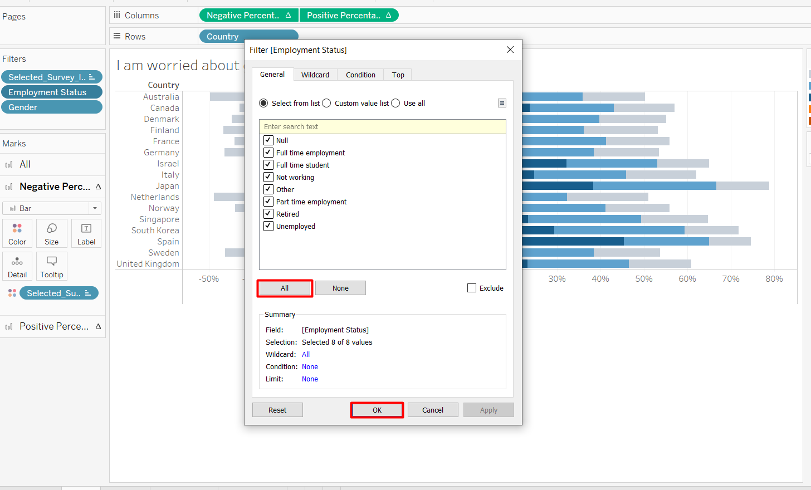

* **Drag Employment Status** to the **Filters**.
* Click **All** > **OK**.
* **Right-click** on the **Employment Status** pill in the filter card > **Show Filter**.
* **Repeat** for **Gender**.

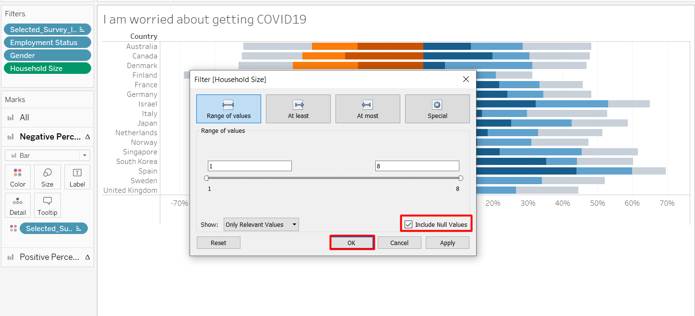

For the numeric filter, the interface is slightly different because we can pick a range of values.

* **Drag Household Size** to the **Filters**.
* **All values** > **Next**.
* Check **include null values** > **OK**. This might dilute the information because the nulls will still be included when we want to examine by a certain household size, but filtering out the nulls can cause us to lose a significant subset of data. For this trade-off, I chose to include the nulls.
* **Right-click** on the **Household Size** pill in the filter card > **Show Filter**.
* **Repeat** for **Household Children** and **Age**.

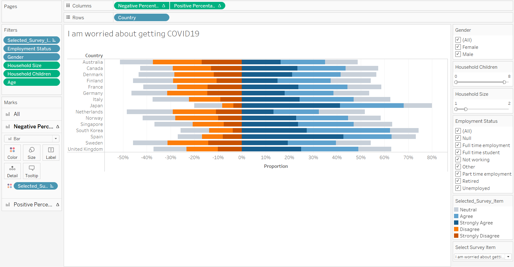

One down, one more to go!

## 4.3. Dot Plot with Error Bars
### Creating Visualisation
The dot plot will visualise the selected response (e.g. Strongly Agree) for the selected survey item in the diverging stacked bar chart. We also need to repeat the steps to create parameters and calculated fields, but with some adjustments.

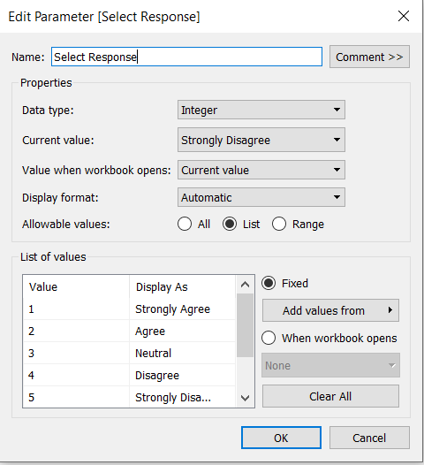

* Use **integer data type** because the survey response values will be in the range of 1 to 5. We will match the value chosen from the parameter with the Selected_Survey_Item value.
* Enter number 1 to 5 for value and the textual descriptions in 'Display As' column.

The formulas we need to add for the dot plot are:

(@) **Count Selected Response**:

    If [Selected_Survey_Item]=[Select Response]
Then 1
else 0
End

(@) **Prop**:

    TOTAL(SUM([Count Selected Response]))/ [Total Count]
    
(@) **Prop 95% Lower Limit%**:

    [Prop] - 1.959964 * sqrt([Prop]*(1-[Prop])/[Total Count])
    
(@) **Prop 95% Upper Limit%**:

    [Prop] + 1.959964 * sqrt([Prop]*(1-[Prop])/[Total Count])
        
(@) **Prop 99% Lower Limit%**:

    [Prop] - 2.575829 * sqrt([Prop]*(1-[Prop])/[Total Count])
        
(@) **Prop 99% Upper Limit%**:

    [Prop] + 2.575829 * sqrt([Prop]*(1-[Prop])/[Total Count])
    
#### Dot Plot
We are going to start by creating the dots for the proportion from the sample.
        
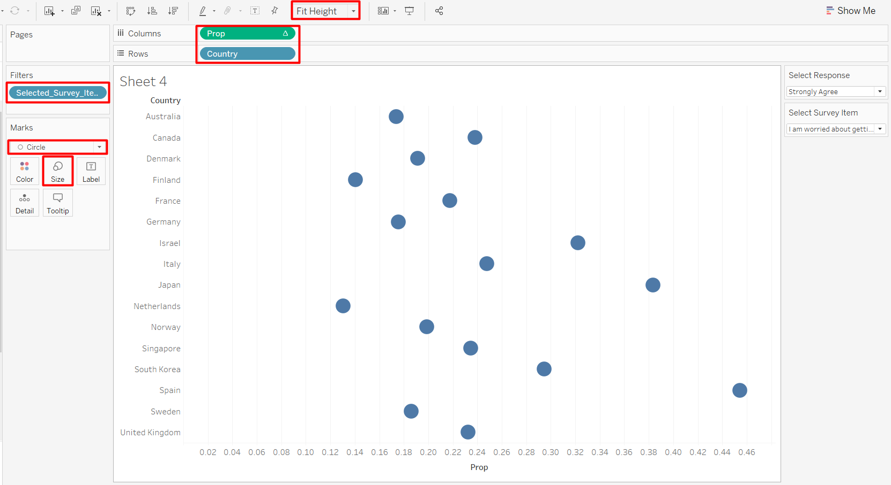

* Put **Prop** in the **Columns.
* Put **Country** for the **Rows**.
* **Filter out** all **null** values in the **Selected Survey Item**.
* Change mark from Automatic to **Circle**.
* Adjust the **size** of the dots to your liking.
* **Show Parameter** so we can toggle and check if it is working properly.

If the dots are in the same value for all countries, make sure that **Prop** is **computed using cell**.

I found a neat trick that we can select **Fit Height** above the column shelf to automatically adjust the height of the chart.

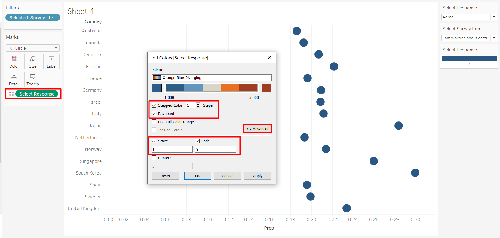

* **Drag Select Response** to the **Color Marks Card**.
* **Double-click** on the colour legend
* Use **Orange-Blue Diverging** palette
* Create a **5 steps reversed** palette. We need to reverse the colours because 1 indicates a positive opinion and we want it to be represented with blue colour. By default it will use red shades for the lower value because usually the lower values are negative and we want them to be red.
* As we only select one response at a time, we need to create the range of values manually. Click **Advanced** > specify **Start** and **End**.
 
You can play around and see how the colour of the dots changes according to the selected response.

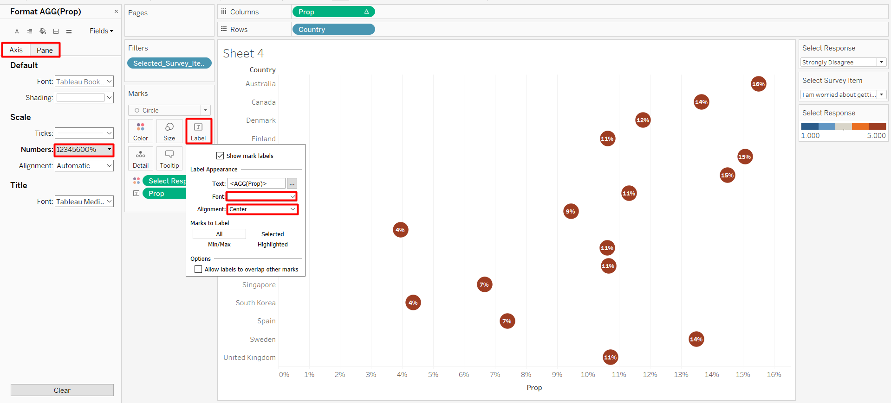

* Add a label value for each of the dots by **dragging Prop** to the **Label Marks Card**.
* **Double-click** on the **Label Marks Card** > Adjust **Font** and **Alignment**. The reason why Font appears blank is because it shows the preview of the text, and I chose white colour so we cannot see it. I used Tableau Bold 8pt. 
* Format the number appearance by doing **right click on the labels** > **Format...**
* Change the number format for both **Axis** and **Pane** to **Percentage** with **0 decimal places**.

We can adjust the circle size again if we need to, but try not to make it very big, otherwise the circles will get cropped.

#### Error Bars
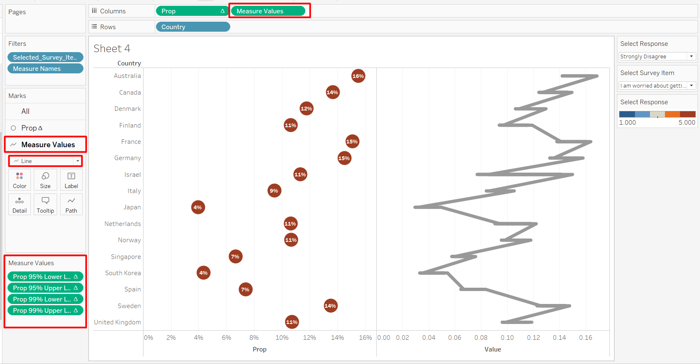

* Add **Measure Values** to the **Columns**.
* Remove away all fields from the **Measure Values** shelf, only retain **Prop 95% Lower Limit**, **Prop 95% Upper Limit**,**Prop 99% Lower Limit**, **Prop 99% Upper Limit**.
* Click the **Measure Values Marks Card** and **remove all fields**. 
* Change the **Marks Type** to **Line**.

Why is the line going zig-zag like a drunk driver? Because we have not specified the path for the lines. 

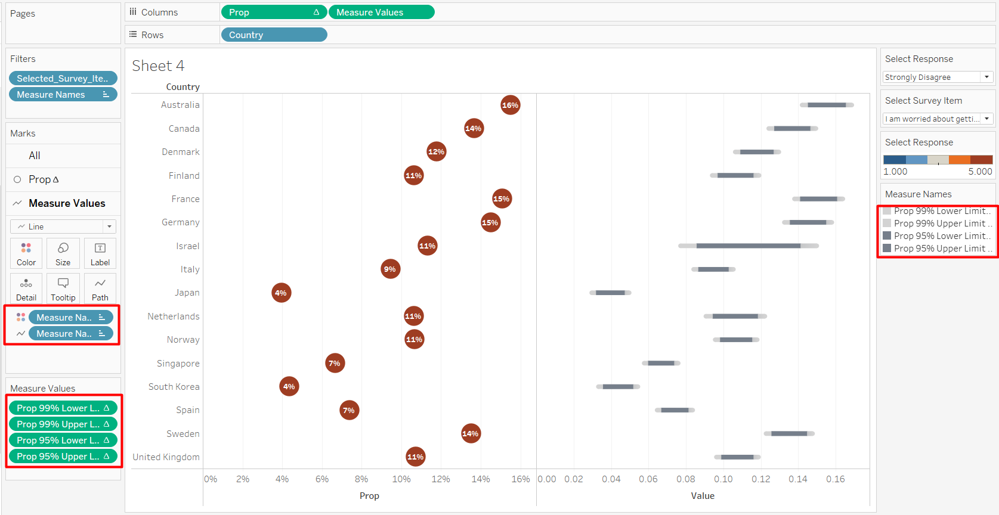

* **Drag Measure Names** to **Colour** and **Path**.
* Tableau draw the line one on top of the other with respect to the order in the Measure Values. We need to reorder it so the 95% confidence interval (CI) will be drawn on top of 99% CI, otherwise we will not be able to see it. **Reorder the fields in Measure Values** so that 99% is above 95%. 
* **Change the colour** by **double-clicking** on the legend. Use a lighter shade for 99% CI and a darker shade for 95% CI.

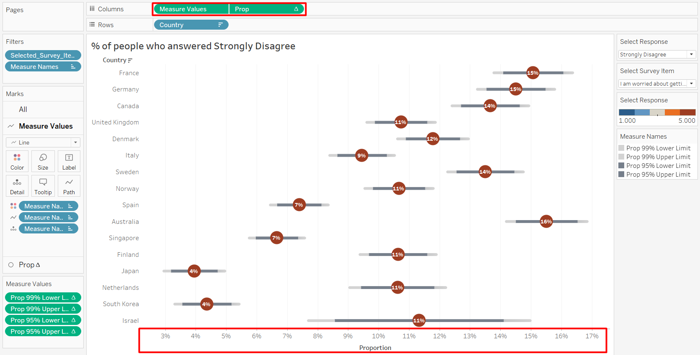

Combine the circle and the confidence interval by using a dual axis.

* **Right-click** on the **Prop** pill on the Columns shelf > **Dual Axis**.
* **Right-click** on one of the axis scale > **Synchronize Axis**.
* Ensure Measure Values comes before Prop so the circle will be on top. If it is not, swap the order.
* To tidy up the visualisation, **edit the format** of the axis scale to show **percentage** and **hide the scale on the top**.

#### Sort
Tableau does not allow sorting using a blended measure, so we need to use a workaround [@tableaukb]. We want to sort according to the order of Prop, so we will use it in the Rows shelf and hide it away.

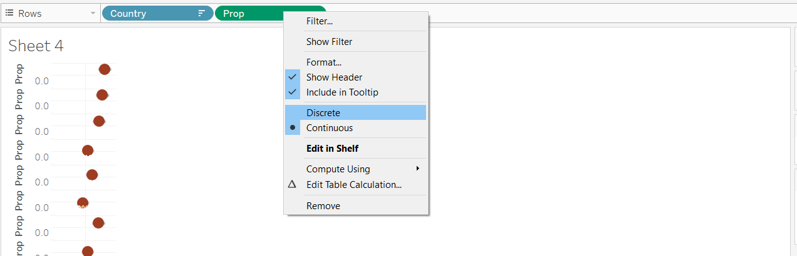

* **Drag Prop** to **Rows** shelf > **right-click** > **Discrete**

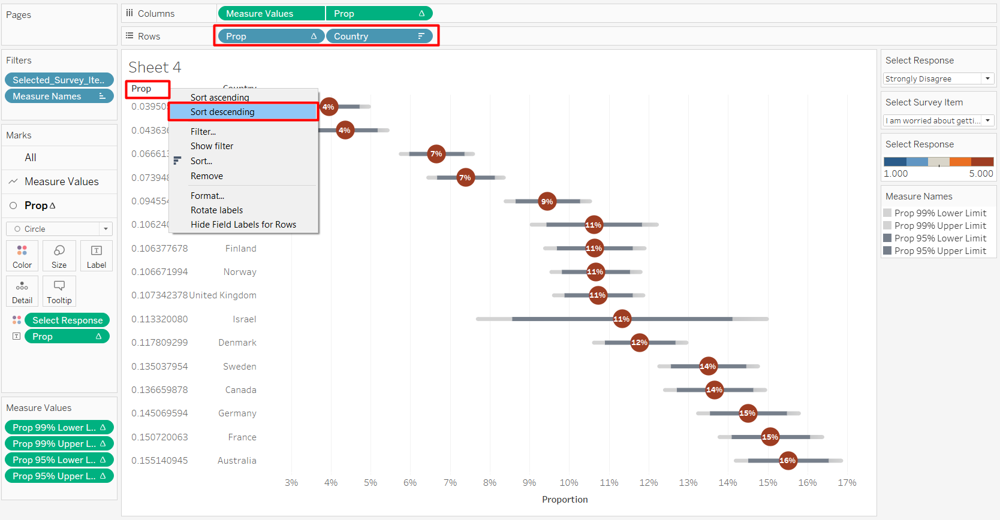

* **Move Prop** pill to before **Country**. Now it will automatically sort the values based on Prop.
* **Right-click** on the **Prop header** > **Sort Descending**.
* **Uncheck Show Header** for **Prop**.

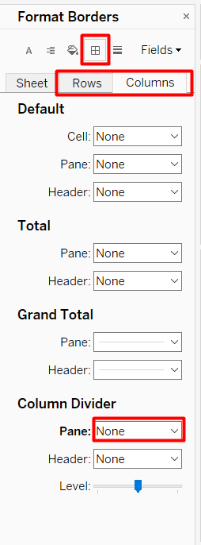

If your visualisation becomes cluttered with gridlines when you added Prop, you can remove them.

* **Right-click** anywhere on the chart > **Format**.
* Choose the **grid icon** > **Rows** > Change **Row Divider** to **None**.
* Repeat for **Column**.

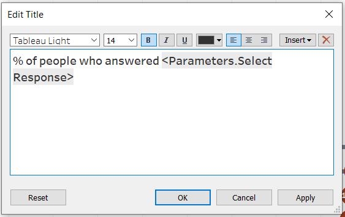

* Last but not least, **edit the title** so it will change dynamically according to the parameter selected by the users.

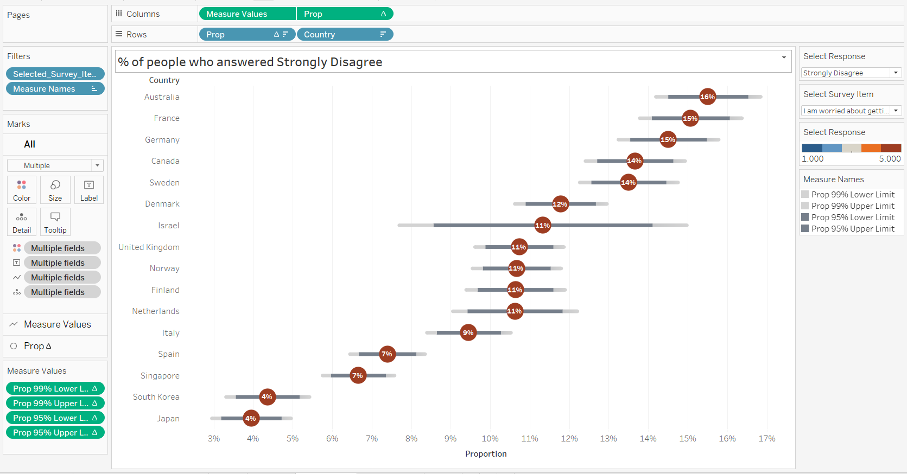

## 4.4. Dashboard
Now we are going to combine the two charts together in a dashboard, but we might still need to go back and adjust a few things in the chart.

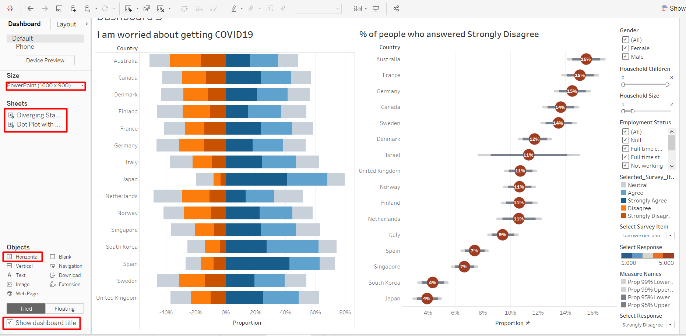

* Choose the **Power Point (1600 x 900)** size.
* **Drag Horizontal** object to the workspace so the charts can be organized properly. We want them to be side by side.
* **Drag Diverging Stacked Bar Chart** from the Sheets pane to the workspace.
* **Drag Dot Plot with Error Bars** from the Sheets pane to the workspace, on the right side of the bar chart.

Does something look weird? Yes, we have not sorted the bar chart according to the order of the countries on the dot plot. **Go back to the Diverging Stacked Bar Chart Sheet** and **repeat the steps to sort the countries according to Prop**. Don't panic if it suddenly becomes an even grid, just ensure the Negative and Positive Percentage are still computed using Selected_Survey_Item.


Before removing the country column for the dot plots, we need to make sure that the sorting works properly and the order of the countries in the two charts are identical. But they are not. This is because the diverging stacked bar chart has filters applied on it, but not the dot plot with error bars. So, we need to apply the filter to all sheets to standardise the sorting order.

* **Right-click** on the **filter** > **Apply to Worksheets** > **All Using This Data Source**.
* Go back to **Dot Plot with Error Bars ** > **Uncheck Show Header for Country** in the Rows shelf.
* While we are here, we probably need to **add a blank line in the title** so it will be aligned when the other chart has a longer title. **Go back to the Dashboard**.
* Notice that Figure 42 shows that we have the options to use single value or multiple values for the filter. I changed the type for **Gender filter** to be **Single Value (list)** because there already an option for all genders. 

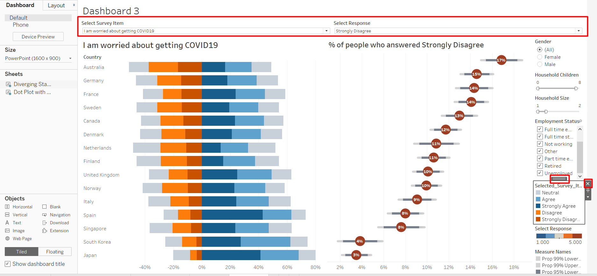

* Add another **Horizontal** object between the chart and the dashboard title.
* **Move** the **Select Survey Item parameter** to **above the diverging stacked bar chart**, and move the **Select Response parameter** to **above the dot plot with error bars**. To move a filter or parameter, **click** on it and drag the **grey rectangle**.
* **Remove** the **Measure Names**, **Select Response**, and **Selected_Survey_item** legends by **clicking the cross mark**. 

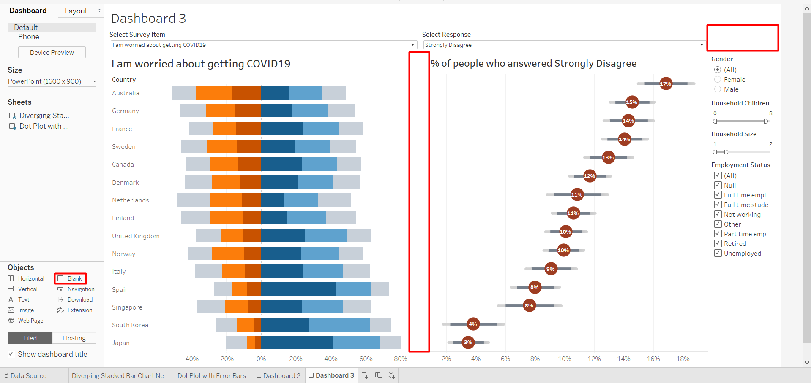

Tableau does not allow us to easy adjust the size of the objects on the dashboard. We can use the workaround to add blanks to add some paddings. 

* **Drag Blank** object to the areas marked on Figure 44. This will give space between the two charts and adjust the size of the Select Response Parameter so it will be aligned with the dot plot.
* **Customise** the **Dashboard title**.

#### Create a Customised Legend
It looks almost complete, but the colour legend is still missing. Because we have to manually order the colour legends for the diverging stacked bar chart, now we need to create a customised legend in a new sheet. 

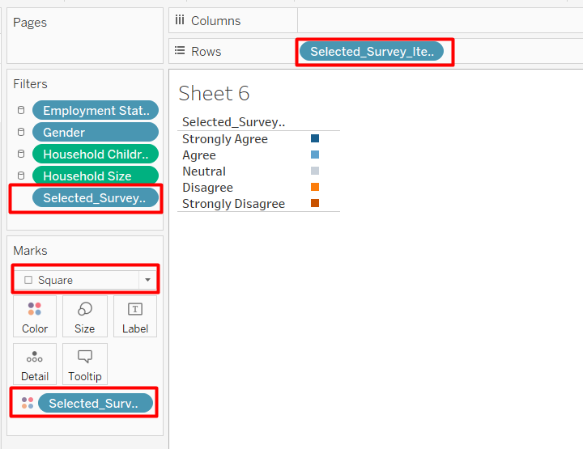

* Create a **New Sheet**
* Add **Selected_Survey_Item** to the **Rows** and **Colour**.
* Change mark type to **Square**.
* **Filter out null** values from the **Selected_Survey_Item**.

It looks quite nice, except the labels are on the left side. We will need a new calculated field to add the label. **Create Calculated Field** with the following formula.

(@) Label:

    CASE [Selected_Survey_Item] 
WHEN 1 then 'Strongly Agree'
WHEN 2 then 'Agree'
WHEN 3 then 'Neutral'
WHEN 4 then 'Disagree'
WHEN 5 then 'Strongly Disagree'
END

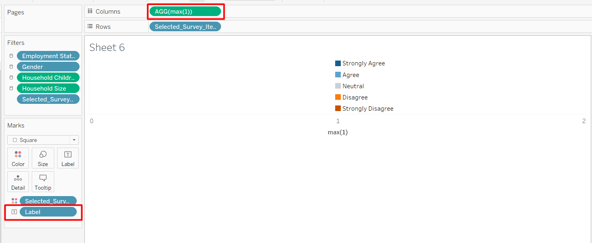

* **Drag Label** to the **Label Marks Card**.
* **Double-click** on the **Columns shelf** > **type 'max(.1)'**. This will create a formula that results in a constant of 1. The value is automatically labeled for us.

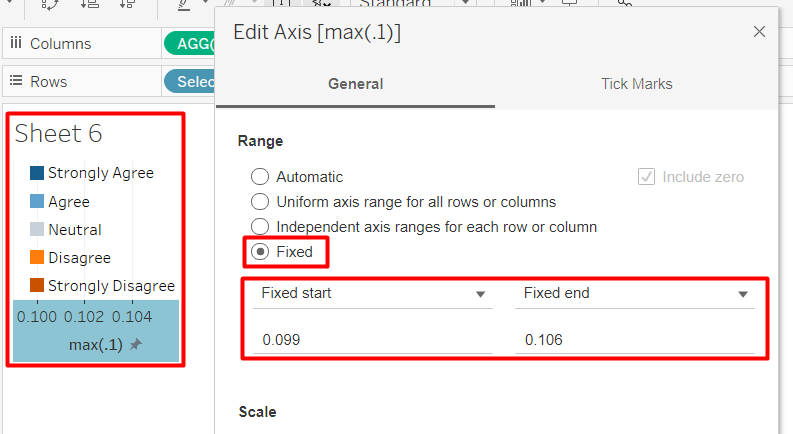

We just need to do a few more minor touch ups.

* **Resize the chart smaller** by hovering to the right end of the chart until a double-sided arrow appears > drag to the left. 
* **Double-click** on the **x-axis** > specify the **Fixed start** and **Fixed end**.
* **Uncheck Show Header** for **AGG(max(.1))**.

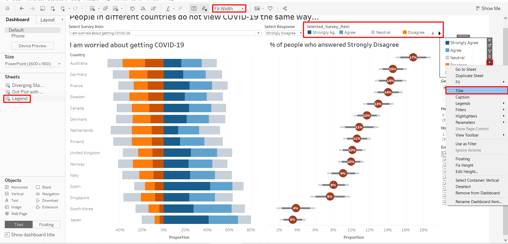

* **Drag** the **Legend sheet** to the top of filters in the right-most column.
* Click on the **inverted triangle** > **Uncheck Title**. Later we are going to add a text object for the title instead. 
* Adjust the size to **Fit Width**.
* **Remove the default colour legend** that comes with the legend sheet. 

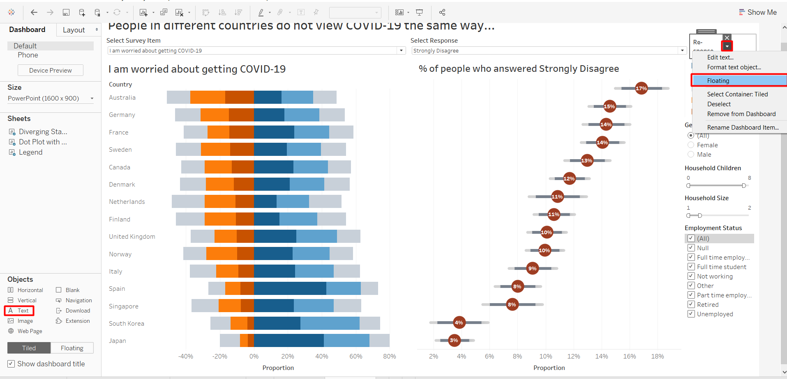

* Add a **text object** to the top of the legend to create a **legend title**. I used a bolded Tableau Medium 9 pt.
* Click on the **inverted triangle** > **Floating**
* Try to align with the filter titles.

In the round of final check, I just realised that age filter was not shown all this while. It is fine, we are human. We make mistakes. If you also forgot some filters, it is not too late to add them in.

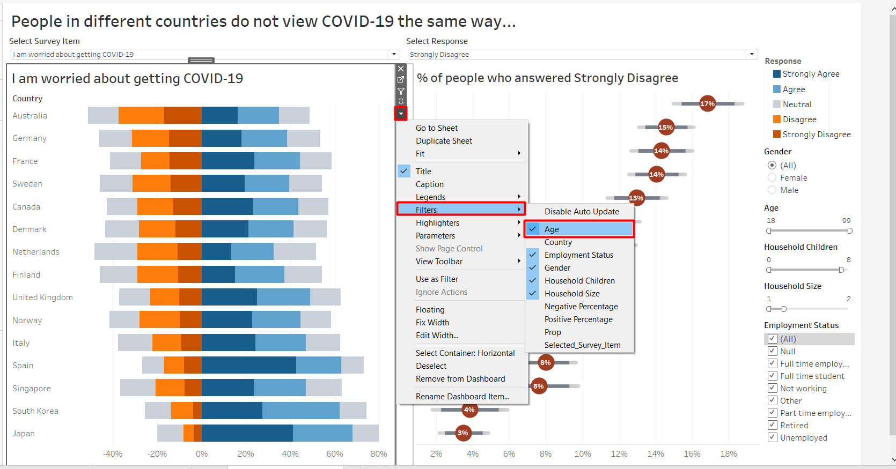


* Click on the **diverging stacked bar chart** where we added the age filter.
* Click on the **inverted triangle** > **Filter** > **Age**.
* Don't forget to apply the filter to all worksheets.
* Reorganise the order of the filters.


**Congratulations, we are done!**

