```{r setup, include=FALSE}
knitr::opts_chunk$set(echo = FALSE)
```

# 1. Introduction 

In 1 February 2021, the military force in Myanmar launched a coup and arrested the civilian leaders, leaving the country in a dire state. The protests over the coup is one of the largest in Myanmar history, and the military have utilised water cannon, rubber bullets and live ammunition in the effort to stop the protesters [@cuddy_2021_myanmar]. 

The country has long been led by a military junta, but a hope for democracy came when the military junta unexpectedly dissolved and appoints civilian ruler, President Then Sein. In 2015, Myanmar held an election, with Aung San Suu Kyi emerging as its de facto leader [@maizland_2021_myanmars]. Ms Suu Kyi is an ignitor for democracy in Myanmar, earning a Nobel Peace Prize while she was under house arrest in 1991 [@cuddy_2021_myanmar]. However, she lost much of her international support after her defence of the military who abuses Muslim Rohingya Minority, and led hundreds of thousands of them fleeing to Bangladesh in 2017 [@bbcnews_2021_aung]. 

Using the [Armed Conflict Location & Event Data Project](https://acleddata.com/) (ACLED) - a disaggregated data collection, analysis & crisis mapping platform that aims to bring clarity to crisis - we are going to examine the armed conflicts that occur in Myanmar during the course of 2015 to 2020.

# 2. Original Visualisation Evaluation
The original visualisation is the [South East Asia Armed Conflict Analysis](https://public.tableau.com/profile/tskam#!/vizhome/South-eastAsiaArmedConflictAnalysis/South-eastAsiaArmedConflictAnalysis) that is hosted in Tableau Public. It reveals the spatio-temporal patterns of armed conflict in selcted South East Asian countries between 2015 and 2020 by using a one-to-one dot-density map where each dot represent an actual event [@a2020_dot], with different colours used for each type of events. 

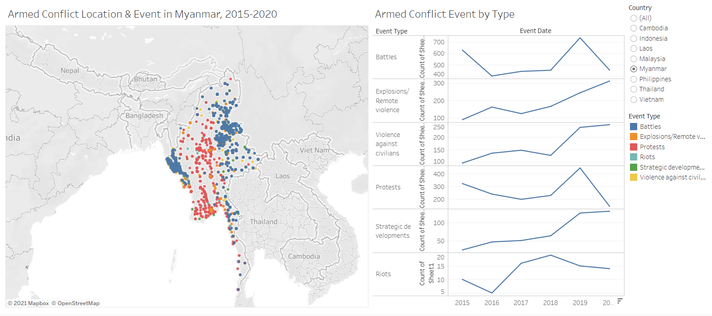

The critiques are given in terms of **clarity**,  **aesthetics**, and **interactivity**.


## 2.1 Clarity
### To keep:
  1. The data is shown using __map to show spatial patterns__.
  
### To improve:
  1. Because the visualisation uses __opaque circles, When the points overlap, we cannot see what is behind the top layer__. This might obscure the density of data, or give the wrong impression that the value is lower some event types just because it is covered. If we only look at Figure 2, it does not seem that there are a lot of violence against civilian in the southern part of Philipines, but Figure 3 shows otherwise. We need to use lower opacity, show the event type one by one, or use other types that can show the values in the viz, such as proportional symbol map, choropleth, or heatmap.
  
  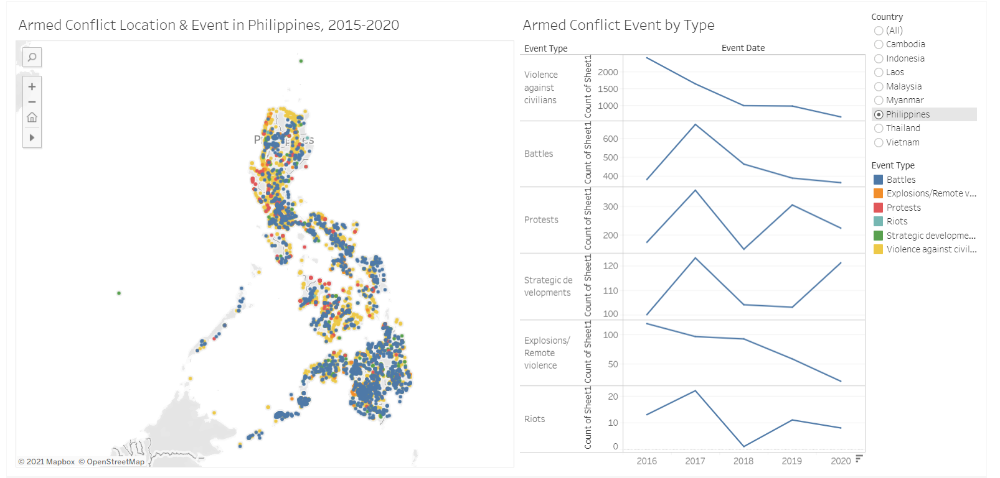
 
 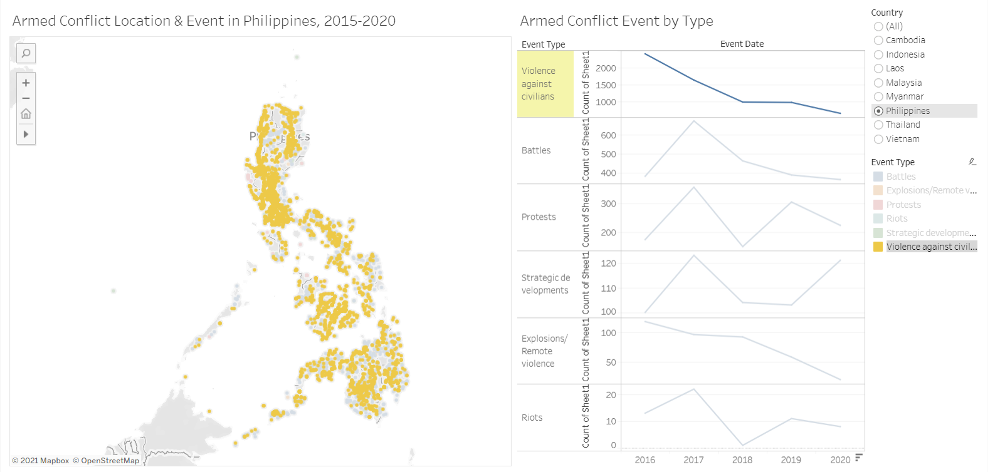
 
  2. There is __no way to see the distribution of events by year, even though a time series line chart exists__.
  
  3. The line chart that shows __the time series of events is hard to compare because they are stacked vertically__. Additionally, the __axes are not standardized__, so it does not have a fixed point of reference to compare the values.
  
  4. The time series is not very accurate because if an event type does not occur in a particular year, the __record is shown as null rather than zero__. This __breaks the line into several parts__ instead of showing a decrease in value.
  
  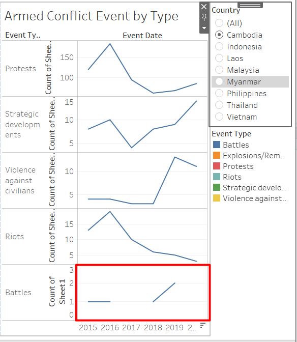
  
  5. Placing the legend of the colors on the right most of the dashboard introduces an unnecessary mental clutter because the __users need to look back and forth between the map and the legend__, as well as having to memorize what does each color represents. The best practice is to remove legend if possible, and label the data directly [@a2021_legends].
  6. The title is quite informative, but there is __no useful lead-in__.
  7. The __y-axis for the line chart is shown as "Count of Sheet 1"__ which can cause confusion. A more descriptive label should be used instead.
  8. The __legends for the colours are truncated__.
  
## 2.2 Aesthetics
### To keep:
  1. The use of __fonts is consistent and easy to read__.
  2. __Terrain is not shown in the background map__, so it looks cleaner and highlights the data being presented, which is the armed conflict locations.
  3. The __colour of less important data are less prominent than the important ones__, for example the axis ticks use grey colour.

### To improve:
  1. Even when we filter to display only one country, only the data points are not shown but the __background map for the other countries are still shown__. This is rather distracting, and would be better if we only show the country of interest.
  
  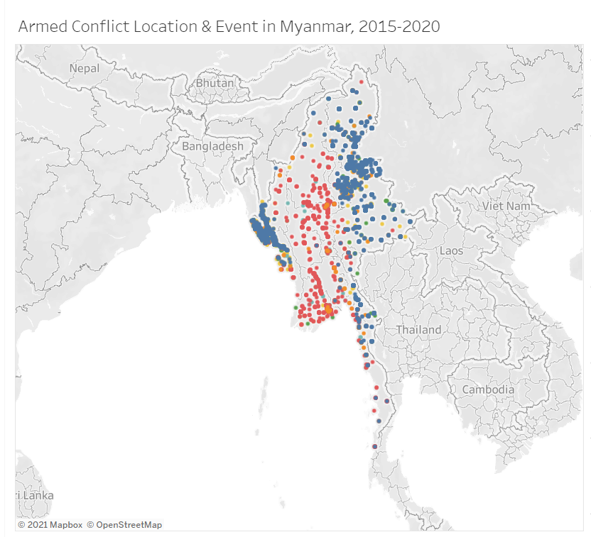
  2. There are __a lot of different colours being used to represent the different types of events__.The choice of colours is too reliant on hue variation instead of value or chroma, hence increasing the visual clutter [@Stone2006ChoosingCF]. It is better to limit the colour palette to 2 or 3 hues and use variation of colour intensity to make the visualisation more aesthetically pleasing and functional.
  
## 2.3 Interactivity
### To keep:
  1. __Dynamic title __ is used that will change according to the selected filter.
  2. The __event type is used as a highlighter that connects to all visualisation on the dashboard__. Both the line chart and the point pattern map will highlight the selected event type. 

### To improve: 
  1. The __information shown in the tooltip is not informative__. The users are unlikely to be interested with the Event ID, latitude, and longitude. The name of the location, the date or description of event might be more relevant.
  
  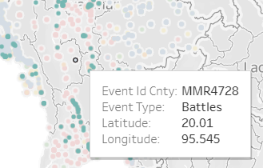

  2. The __transition between choosing different country filter is a little bit choppy__. We can use animation to make it more smooth.
  

# 3. Alternative Graphical Representation

The proposed design is shown in Figure 7.

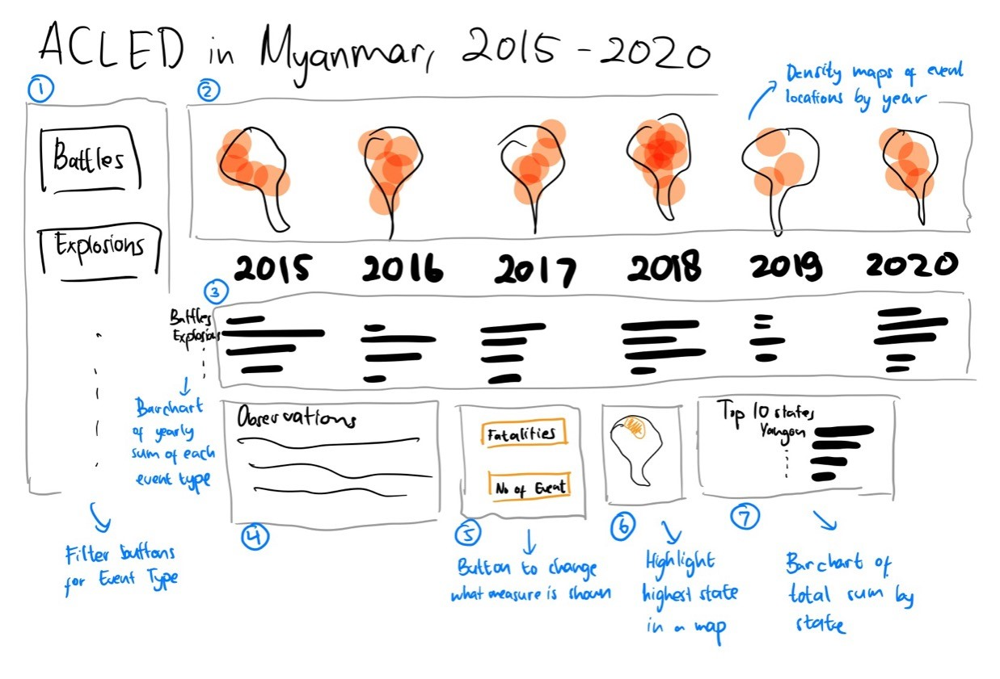
Due to the problem of the overlapping points (Clarity #1), I have decided to use another way to represent the spatial data. Initially, I thought of using a proportional symbol map with lower opacity to better represent the data, as the overlapping points will contribute to the size of the symbol. However, this method requires aggregation, and there is a problem in the mapping of the geographical data. There were hundreds of unrecognized location from the Admin 3 attribute (The third largest sub-national administrative region in which
the event took place [@armed_conflict_location_and_events_data_project_acled_2019_armed]). Aggregating on the higher level would not solve the issue. Even though the number of unrecognized location would be manageable to resolve manually, but the map will be less meaningful because it is too aggregated. Therefore, as shown in number 2 in Figure 7, I have decided to create density maps to represent the data instead.

This alternative resolves the issues shown in section 2 as the following. Numerical references in the section below are tied to the numbered items in the proposed alternative visualisation in Figure 7.

## 3.1 Clarity
  1. Using density maps to show the geospatial patterns of the armed conflict events can take advantage of the overlapping points (2) . However since we cannot use varying colours for the density maps, a filter for the event types (1) is used instead.nes Only Violence Against Civilian](./images/2. Philippines Violence against Civilian.png)
 
  2. The visualisation will use a trellis for both the density map (2) and the bar chart (3). This allows the user to see the distribution of events in the geographical location as well as by event type by year.
  
  3. The bar chart is broken down by year in the trellis (3). This would make is easier for the user to compare the values between event types, even though it might be difficult to compare different years. However, by standardizing the axes for the values, the user can still compare the height of the bars in different years when the difference is big.
  
  4. Line chart is not used.
  
  5. Using a filter instead of using different colours for each even type removes the need to put a colour legend.
  
  6. Description is provided (4).
  
  7. Use more descriptive axis labels (not shown in Figure 7).
  
  8. Adjust the size to make sure they are not truncated (not shown in Figure 7).
  
## 3.2 Aesthetics
  1. Do not use the default map background from Tableau but use the shp file for Myanmar to provide the map background (2).
  
  2. The different event types are no longer differentiated by colours because it is used as a filter (1,2). The bar charts will also use the same colour for the bars. A colour palette of black and red will be used for this visualisation.
  
## 3.3 Interactivity
### To improve: 
  1. Show the name of the location, the date or description of event in the tooltip (not shown in Figure 7).

  2. Use animation (not shown in Figure 7).
  
## 3.4 Additional Features
Other than addressing the issues in the original visualisation, there are some additional features added to the dashboard. 

  1. The codebook reveals that the data also stores the number of fatalities, which may also be of interest. Therefore, a parameter to toggle between displaying the values based on the number of events or fatalities is provided (5).
  2. To provide a high-level aggregate of the data, the state with the highest number of selected measure is highlighted (6). It will be done in the state level due to the unrecognized values in lower level. Showing the data in form of a map helps the user if they do not know the areas of Myanmar well.
  3. Comparing the aggregate values by state would also help the user to see the actual number of events (7), that will complement the density map. 

# 4. Step-by-Step Description 
I will assume you have some basic knowledge of Tableau, so I will not describe into very deep details for the routine Tableau operations such as importing data. Refer to my [first dataviz makeover post](https://gabriellapauline.netlify.app/posts/2021-01-29-dataviz-makeover-1/) if you need more details.

## 4.0 Set Up 
* Download the data from [Armed Conflict Location & Event Data Project](https://acleddata.com/) using the Data Export Tool for Southeast Asia
* Download the Myanmar map polygon data from [ArcGISHub](https://hub.arcgis.com/). Get the [national boundary](https://hub.arcgis.com/datasets/MIMU::myanmar-national-boundary?geometry=63.295%2C11.983%2C130.048%2C26.458) for the density map and the [state and region boundary](https://hub.arcgis.com/datasets/MIMU::myanmar-state-and-region-boundary?geometry=63.295%2C11.983%2C130.048%2C26.458) to highlight the state with the highest number of events or fatalities. 
* Create a new Tableau workbook

### Join data from multiple sources together

* Connect to Data > Spatial File > Select the National Boundary data for Myanmar
* Add new data > Select the ACLED data 

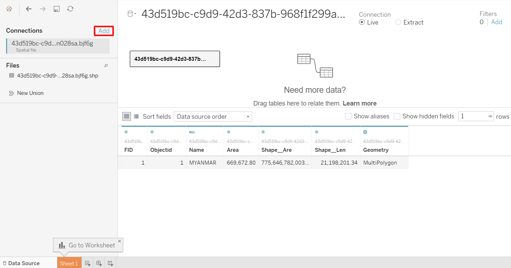

* Drag the File to the workspace to define a relationship, then select the fields to be matched. The Name field from the national boundary is equivalent to country in the ACLED data.

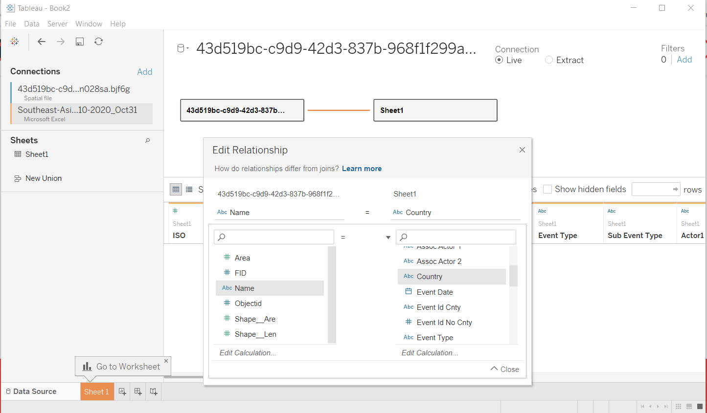

* Repeat adding the state and region boundary file, and define the relationship with the ACLED data. Admin 1 from ACLED should be equivalent to ST from the state and region boundary file.
* Just to make it easier to read, rename the connection by double-clicking on the connection name. Also rename ST to State so it will be easier to understand.

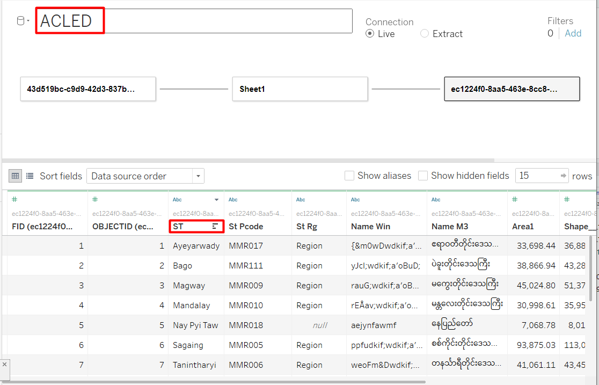

## 4.1 Create customised filters
We can use parameters to simulate a custom filter. I have decided to use icons as the buttons, so first we need to download the icons first. I got my icons from [The Noun Project](https://thenounproject.com/). 

* Put the icon jpeg files in a new folder inside My Tableau Repository/Shapes folder, usually in Documents but it might be different.

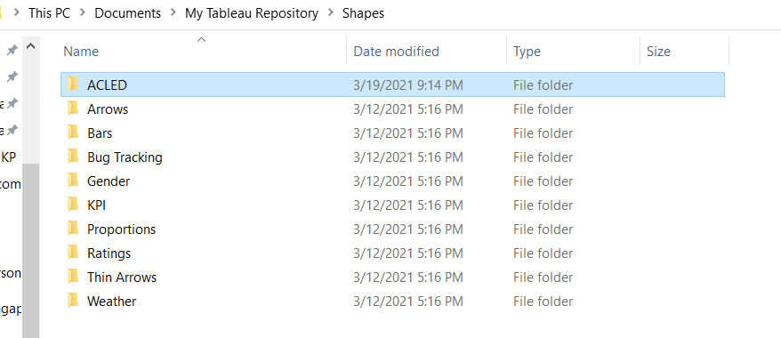

We also need to create an Excel file containing all the values for the icons.

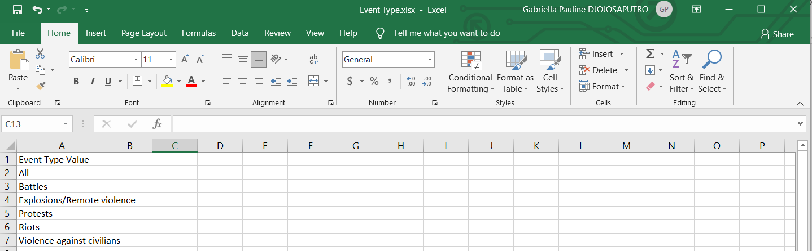

I added a value called "All" and removed "Strategic Development". As strategic development is a non-armed event, I want to leave it out.

* Go to Data Source Tab and add a new connection 


### Create Parameter

* From the data pane, click on the grey triangle beside the search box > Create Parameter... 
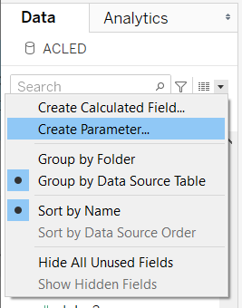

* A dialog box will appear for us to enter the details of the parameters
  * Enter parameter name
  * Change data type to String
  * Change allowable values to List
  * To reduce some manual work, click Add values from > your newly created excel file > Event Type Value. This will auto-populate the parameter values with the values of Event Type Value in the spreadsheet that we have just created.
  
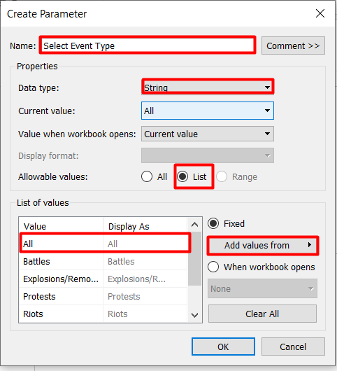

### Create custom icons

* Drop the Event Type Value to Rows shelf to make it be displayed in multiple rows and Label Marks Card to actually label the icons.
* Change the Marks Type to Shape
* Drop the Event Type Value to Shape Marks Card

Your screen should look like the screenshot below.

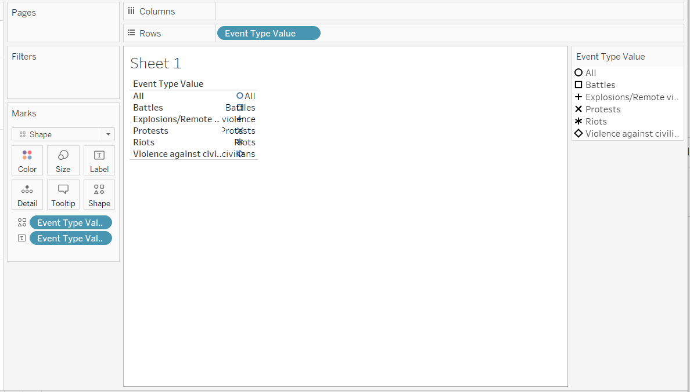

* Double-click on the Shape Marks Card to open the Edit Shape window

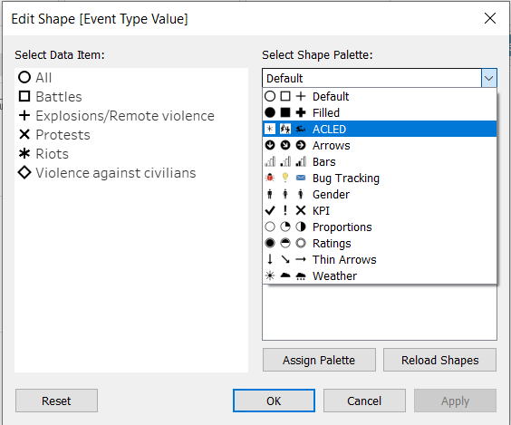

Your new custom icons should appear under Shape Palette. If it doesn't, try Reload Shapes or close the workbook and open again.

* Click on the data item then click on the icon to assign the icon to a particular data item
* Click Apply > OK

Now We just have to do some adjustments to make it look nicer.

* Change the display from Standard to Fit Height 

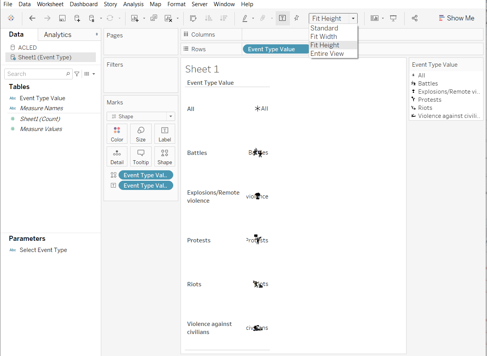

* Double-click on the Label Marks Card and change the alignment to bottom-center.

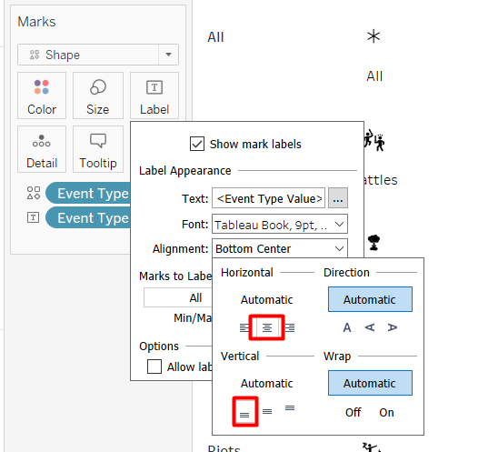

* Unshow the header by right-clicking on the Event Type Value pill in the Rows Shelf > Uncheck Show Header. We do not need it anymore because we already have the label.

* Double Click on the Size Marks Card and adjust the size to make the icon bigger

* Remove the lines on the top and bottom of the icons. From the drop-down menu, click Format > Borders then change the Pane Row Divider to None in the panel.

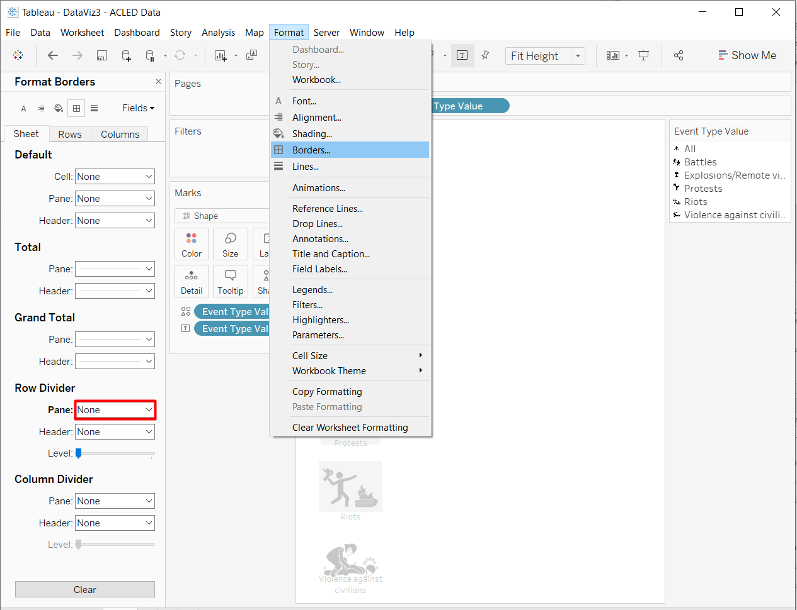

We have done the first element of the visualisation. Your screen should look like the screenshot below.
The linking for the filter will be done later at the dashboard.

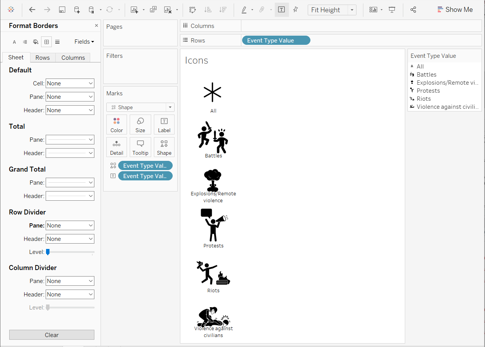

