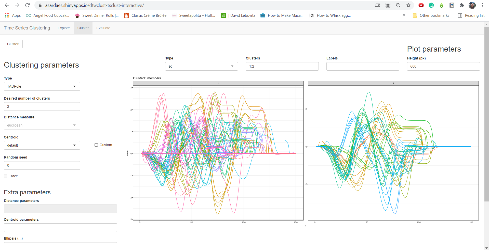
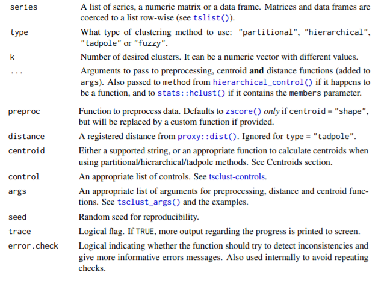
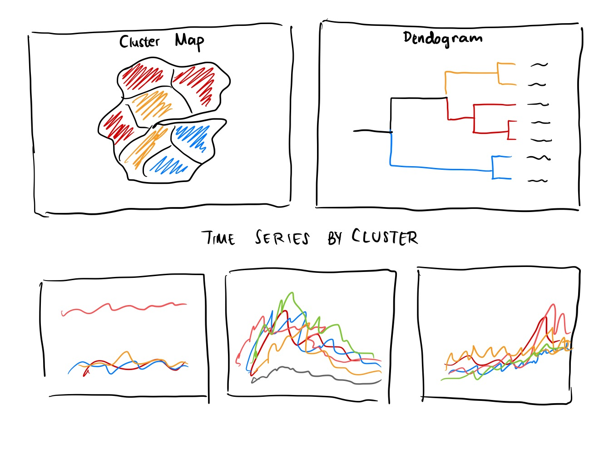
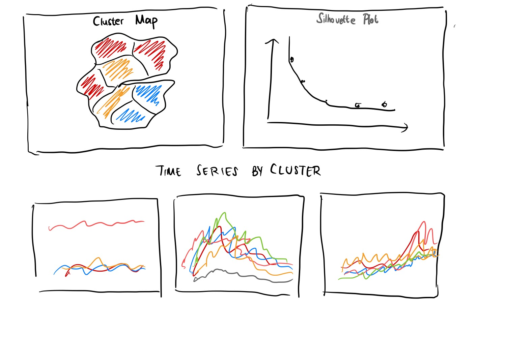

# 1. Introduction 

Crime analysis can assist police the police in criminal apprehension, crime reduction, prevention, and evaluation. The three key types of information used to analyse crime data are sociodemographic, spatial, and temporal [@santos_2017_crime]. It has been done as far back as in 1829, when Adriano Balbi and André Michel Guerry did a crime mapping for the educational level and violent and property crime in France [@hunt_2019_from].

Spatial and temporal data are particularly important. As the environmental criminology theory by Paul and Patricia Brantingham states, crime is a complex event which requires a law, an offender, and a target to intersect in a place at one time [@hunt_2019_from]. This suggests that crimes may spatially cluster because the offenders might have invested their time and energy to master the "battleground", or there might be more susceptible targets.

Finding these spatial crime clusters would help the purpose to aid criminal apprehension, crime reduction, prevention, and evaluation. This analysis will focus on the crime recorded in London, which can be obtained from the [London Datastore](https://data.london.gov.uk/dataset/recorded_crime_summary).

This assignment is done as a groundwork for an interactive Shiny app. The purpose of this assignment is to explore the packages that can be used and finding how interactivity can be added to the application to help the users in exploring the data.

# 2. Literature Review

## 2.1. Clustering with spatiotemporal data

There are 6 broad categories of spatiotemporal clustering [@ansari_2019_spatiotemporal]:

1. Event clustering: finding group of events that is close to each other in both space and time dimension.
1. Geo-referenced data item clustering: finding a group of objects that are similar at any point of time with spatial data as one of its attribute.
1. Geo-referenced time series clustering: grouping objects based on spatial proximity and time series similarity.
1. Moving clusters: detect behaviour of moving objects.
1. Trajectory clustering: find a cluster of objects that have similar movement behaviour.
1. Semantic based trajectory data mining: incorporate domain-specific knowledge to trajectory clustering.

As our data has the total number of crime of a particular type committed in a location per month, it is more appropriate for us to do geo-referenced time series clustering. We will identify locations in the United Kingdom that have similar pattern of crime rate increase / decrease.We can also compare the results of the geo-referenced time series clustering with normal clustering and geographically weighted clustering.

We will do time series clustering using __dtwclust__ package in R. In the Shiny app, we can also compare the results with geospatial clustering packages, but this is outside the scope of this assignment. The geospatial clustering packages are explored separately by other contributors of the project.

## 2.2. Dynamic Time Warping

Dynamic time warping (DTW) uses dynamic programming find the optimum data points to compare to in a time series[@sardaespinosa_2019_timeseries]. This means the data points might not be one-to-one comparison for identical time of observation, but it will find the data point that will produce the lowest distance. A graphical representation of the comparison is shown in Figure 1.

![Figure 1. DTW graphical representation [@sardaespinosa_2019_timeseries]](./images/dtw_visualisation.png)

__dtwclust__ package that is used in this project is created by  Alexis Sarda-Espinosa and is available at [CRAN](https://cran.r-project.org/web/packages/dtwclust/). 

## 2.3. Visual Analytics for Spatiotemporal Clustering

As the results of machine learning depends on the hyperparameter in the setup, a lot of effort and time goes into iteratively trying and evaluating the results of using different parameters [@li_hypertuner]. Traditionally, the users would need to go through an iterative process of clustering. This involves preparing the data, performing transformation to the data, performing clustering analysis with an arbitrary parameters, evaluating whether the results make sense, and iteratively going back to the data preparation or analysis steps to try other approaches in hope that it would yield a better results. This process is time consuming and takes up a lot of resources. By incorporating visual analytics, we can provide a faster feedback so the users would be able to better evaluate the results and choose the optimum parameters easily [@ali_2019_clustering; @li_hypertuner]. 

Visual analytics, especially when interactive exploration is supported, is beneficial because it facilitates the collaboration between machine capabilities and human capabilities to explore, analyse, understand, and gain insights from data [@ali_2019_clustering]. Waehner [-@waehner_2016_using] further adds that visual analytics allows the users to perform analytics, data wrangling, and data discovery without any coding involved, thus democratising data analytics.

Following this trend, Ali et al. [-@ali_2019_clustering] also found that there is an increasing trend of usage of line plots, geographic maps, heat maps, histograms, and graphs for time series data. There are also several examples of interactive visual analytics available, the examples are reviewed below.

### 2.3.1. dtwclust Sample Shiny App

__dtwclust__ package provides a sample shiny app that can be accessed using ```interactive_clustering()```. This app is also publicly hosted in [Shinyapps.io website](https://asardaes.shinyapps.io/dtwclust-tsclust-interactive/). 



This app provides a way to get the time series by cluster visualisation easily in a faceted plot, after taking the arguments from the user. However, it does not provide a way to evaluate the clusters formed visually other than using the time series plot itself. The metrics are provided in a text, and we can only compute the clustering metrics only for the specified number of clusters in the plot. If we want to see the number of optimum cluster, we need to check different number and manually compare whether the value for the evaluation metrics increase or decrease. Besides, because this package is more focused on time series clustering, there is no map shown in the Shiny app.

### 2.3.2. SpatialEpiApp Spatiotemporal Clustering for Disease

SpatialEpiApp is a Shiny web to visualise spatial and spatiotemporal clustering for disease data [@moraga_2017_spatialepiapp]. However the app is more towards event clustering rather than a time series clustering, as it aims to find a cluster of disease from certain location and point in time. As the dtwclust sample Shiny app, it is also available in the [Shinyapps.io website](https://paulamoraga.shinyapps.io/spatialepiapp/). The app consists of several interesting tabs for visual analytics:

1. Interactive tab

Shows the data, and results in the form of a map and a time series plot. 

![Figure 3. SpatialEpiApp Interactive Tab [@moraga_2017_spatialepiapp]](./images/spatialepiapp.png)

2. Maps tab

Shows the maps and temporal trend plots. 

![Figure 4. SpatialEpiApp Maps Tab [@moraga_2017_spatialepiapp]](./images/spatialepiapp_maps.png)

3. Clusters tab

Shows the map and the time period of the clusters found.

![Figure 5. SpatialEpiApp Clusters tab [@moraga_2017_spatialepiapp]](./images/spatialepiapp_clusters.png)

The good thing about the three visualisation is that we can see both the spatial and temporal patterns in the data because it provides both map and the trend in the form of a parallel coordinate. However, it has less parameters to change and it still does not provide a convenient way to find the optimum number of clusters.

## 2.4. R Packages

The packages that we are going to use in this analysis are in the table below.

Package | Description
--------|------------
dendextend | Functions to adjust the visualisation of a dendrogram object.
dtwclust | Clustering using DTW algorithm.
egg | Extensions for ggplot2 objects, that helps customisation.
ggdendro | Functions to extract the data from a
RColorBrewer | Provides colour palettes.
ggthemes | Adds extra themes, geoms, and sclaes for ggplot2.
lubridate | Functions to deal with date-time data.
plotly | Create interactive version of ggplot2 graphs using plotly.js library.
sf | A way to encode spatial vector data in a simple features format.
tidyverse | A set of packages that deals with tidy data format for data science.
timetk | Toolkit for working with time series in R.
tmap | Flexible visualisation package for geographical maps.
zoo | Z's ordered observations to deal with irregular time series pattern.

# 3. Exploratory Data Analysis

## 3.1. Set Up Environment

We need to set up the environment and load all required packages first. The code chunk below will install the packages if not yet installed, and load them to the environment.

```{r echo=TRUE, message=FALSE, warning=FALSE}
packages = c("tidyverse","timetk", "egg", "lubridate","zoo","sf", "tmap","dtwclust","plotly", "ggthemes","dendextend","ggdendro", "RColorBrewer")
for (p in packages){
  if (!require(p,character.only = T)){
    install.packages(p)
    }
  library(p,character.only = T)
}
```

## 3.2. Crime Data

The data is obtained from London Datastore website [-@londondatastore_2021_recorded]. The website provides the monthly number of crime recorded by ward and by borough. We would need other explanatory variables for the Shiny applications, such as population and income. However, since these data are only available at borough level, we will only be looking at the borough level data for crime.

The data is separated 2 files: one for 2010 to 2018 time period, another one for 2019 to 2020. Because there are some discrepancies between the crime category naming, and 2020 is an unusual year due to COVID-19, only 2010 to 2018 data will be used. We will use ```read_csv()``` function to load the data from csv format, and we can use ```glimpse()``` function to take a glimpse on the structure and values for each column.

```{r}
crime <- read_csv('./data/aspatial/MPS_Borough_Level_Crime_Historic.csv')
```

The data is currently in a wide format, so we will use ```gather()``` function from __tidyverse__ to transform it into a long format. We will use the column names as a Date column and the values as a Count column.

```{r}
crime_long <- crime %>%
  pivot_longer(cols = starts_with("20"), #pivot only columns that starts with "20" because it contains the values
               names_to="Date",
               values_to = "Count")

glimpse(crime_long)
```

Notice that the year is still in a string format. We can use ```ymd()``` function in __lubridate__ package to convert year-month-date formatted string or numbers into date. However, since our data only have the year and month, we need to use ```paste0()``` function to append "01" at the end so the format can be recognised.

```{r}
crime_long$Date <- ymd(paste0(crime_long$Date,"01"))

glimpse(crime_long)
```


## 3.3. Time Series Data Exploration

To explore the data, we can use __timetk__ package that extends __tidyverse__ to deal with time series data. This package also acts as a plotly wrapper to enable interactive time series which is useful to explore the data.

### 3.3.2 Explore raw count of crime recorded

First, we are going to see the time series of lowest level of aggregation in the data, which is by `Minor Category`. We will choose two boroughs arbitrarily just to explore the data. 

```{r}
crime_long %>%
  filter(Borough==c("Westminster", "Barking and Dagenham")) %>%
  plot_time_series(Date,Count,
                   .color_var=`Minor Category`,
                   .facet_vars=Borough,
                   .facet_ncol = 2,
                   .facet_scales="fixed",
                   .title = "Crime Minor Category Count Time Series",
                   .x_lab = "Date",
                   .y_lab = "Count",
                   .smooth = FALSE,
                   .legend_show = FALSE,
                   .interactive=TRUE)
```

Just based on these 2 time series, we can see that the crime pattern in these two boroughs are very different. The count of recorded crime for Other Theft minor category is much higher than the other categories in Westminster, while it is similar to other crimes for Barking and Dagenham. 

We can also aggregate the data to see the total for each major categories. We can expose the level of aggregation to be toggled by the users later in the Shiny app.

```{r}
crime_major <- crime_long %>%
  group_by(Date, Borough, `Major Category`) %>%
  summarise(across(Count,sum)) %>%
  ungroup()

glimpse(crime_major)

crime_major %>%
  filter(Borough==c("Westminster","Barking and Dagenham")) %>%
  plot_time_series(Date,Count,
                   .color_var=`Major Category`,
                   .facet_vars=Borough,
                   .facet_ncol = 2,
                   .facet_scales="fixed",
                   .title = "Crime Major Category Count Time Series",
                   .x_lab = "Date",
                   .y_lab = "Count",
                   .smooth = FALSE,
                   .legend_show = FALSE,
                   .interactive=TRUE)
  
```

An interesting insight revealed by these aggregated time series is that the number of fraud or forgery cases drastically decreased to less than 10 cases per month since 2013. There is also a decreasing trend for theft cases from 2012 in both boroughs, but it increased again since 2017 in Westminster. The slope of change is also much steeper in Westminster. 

However, taking the raw count as it is might be an unfair comparison. In a borough with larger population, the recorded crime cases will also be naturally higher. Therefore, we will normalize the crime count by population in each borough.

### 3.3.2 Normalize crime count by population

First, we need to read the data and join it to the crime time series data. Don't forget to convert the Year column as a date field.

```{r}
pop <- read_csv('./data/aspatial/housing-density-borough.csv')

pop$Year <- ymd(paste0(pop$Year,"-01-01"))

glimpse(pop)
```

The population data is a yearly data, but we need a monthly data because we will divide the count of crime by the population in the borough (in millions). We will join the population data with a monthly date series and do linear interpolation. Note that we need to get the date from the start of the year and add another year to the last date so we can have a complete linear interpolated values. __lubridate__ also provides other functions to wrangle time data, such as to replace elements of the date and get a relative date using ```%m+%``` function.

```{r}
# Create monthly date
start_date <- min(crime_major$Date)
month(start_date) <- 1

end_date <- max(crime_major$Date)
month(end_date) <- 1
end_date <- end_date %m+% years(1)

monthly_dates <- seq(from=start_date,
                     to=end_date,
                     by="month")

# Cross join the date and borough
monthly_borough <- merge(monthly_dates, unique(pop$Name), by=NULL) %>%
  rename(Date = x,
         Borough = y)

glimpse(monthly_borough)
```

We are going to use __zoo__ package to do linear interpolation on the data. First we will join the monthly time series with the population, then we will group by the borough before doing the linear interpolation.

```{r}
monthly_pop <- left_join(monthly_borough,pop,
                        by = c("Borough"="Name","Date"="Year")) %>%
  select(Date,Borough,Population) %>%
  group_by(Borough) %>%
  mutate_at("Population",na.approx, na.rm=FALSE)%>%
  ungroup()

#Plot the time series to check
monthly_pop %>%
  # filter(Code==crime_major$GSS_Code[1])%>%
  plot_time_series(Date,Population,
                   .color_var=Borough,
                   .title = "Interpolated Monthly Population",
                   .x_lab = "Date",
                   .y_lab = "Population",
                   .smooth = FALSE,
                   .legend_show = FALSE,
                   .interactive=TRUE)

```

The data points are nicely interpolated, but there is a break in the line for London. This means the name of the borough changed between 2010 and 2011. Let's check which name is used in the crime data.

```{r}
unique(crime_major$Borough)
```

Since we don't have the data for London borough in the crime data, we can ignore the inconsistent naming, this column will be dropped later.

Now we are going to join the monthly population with crime major so we can normalize the rate. But let's check if the naming for borough is consistent between the crime data and population data.

```{r}
#Borough name only exists in crime data
unique(crime_major$Borough[!(crime_major$Borough %in% pop$Name)])

#Borough name only exists in pop data
unique(pop$Name[!(pop$Name %in% crime_major$Borough)])
```

The names are consistent, we just don't have the crime count for London. We can safely join the two dataframes using ```left_join()``` function from __tidyverse__.

```{r}

crime_rate <- left_join(crime_major,monthly_pop,
                        by = c("Date"="Date","Borough"="Borough")) %>% 
  mutate(Crime_Rate = Count/Population*10^6)

glimpse(crime_rate)
```

Let's compare the crime rate through the years for borough with the highest and lowest population.  

```{r}
#Borough with highest population
crime_rate[crime_rate$Population==max(crime_rate$Population),]

#Borough with highest population
crime_rate[crime_rate$Population==min(crime_rate$Population),]
```

We can plot it in time series to allow easier comparison.

```{r}
crime_rate %>%
  filter(Borough==c("Barnet","Kensington and Chelsea")) %>%
  plot_time_series(Date,Count,
                   .color_var=`Major Category`,
                   .facet_vars=Borough,
                   .facet_ncol = 2,
                   .facet_scales="fixed",
                   .title = "Crime Major Category Count Time Series",
                   .x_lab = "Date",
                   .y_lab = "Crime Count",
                   .smooth = FALSE,
                   .legend_show = FALSE,
                   .interactive=TRUE)
```

At first glance, it seems that Barnet has a higher crime rate in general, except for Theft and Handling category which is roughly the same. Now let's compare with the time series using the rate, normalized by population.

```{r}
crime_rate %>%
  filter(Borough==c("Barnet","Kensington and Chelsea")) %>%
  plot_time_series(Date,Crime_Rate,
                   .color_var=`Major Category`,
                   .facet_vars=Borough,
                   .facet_ncol = 2,
                   .facet_scales="fixed",
                   .title = "Crime Major Category Count Time Series",
                   .x_lab = "Date",
                   .y_lab = "Crime/1 million
                   population",
                   .smooth = FALSE,
                   .legend_show = FALSE,
                   .interactive=TRUE)
```

After normalising the data using the population, apparently the crime rate for Criminal Damage, Robbery, and Fraud or Forgery is similar in the two boroughs. However, Kensington and Chelsea has a significantly higher rate of Theft and Handling compared to Barnet.

## 3.4. Geospatial Data Exploration

We can use a map to see the distribution of crime records in different boroughs. To do so, we need the geospatial data that contains the polygon for each borough. The data is also obtained from London Datastore [-@londondatastore_2021_statistical]. Using ```st_read()``` function, the file will be read as a simple feature format.

```{r}
mp_borough <- st_read('./data/geospatial/statistical-gis-boundaries-london/ESRI',
                      layer = 'London_Borough_Excluding_MHW')

glimpse(mp_borough)
```

To draw the map, we will take average of recorded crime for each of the major crime category. Then, we will join the crime data with the geospatial data using ```left_join()``` function. As the previous example, don't forget to check that there is no discrepancy in the keys to join the data tables. A faster way to check is by using ```setdiff()``` function which is based on set operations. However, we do not know which dataframe does the lonely borough belongs to.

```{r}
#Check difference in borough names
setdiff(mp_borough$NAME, crime_major$Borough)

#Compute average rate
avg_crime <- crime_rate %>%
  group_by(Borough, `Major Category`) %>%
  summarise(AvgCrimeRate = mean(Crime_Rate),
            AvgCount = mean(Count),
            AvgPop = mean(Population)) %>%
  ungroup()
  
#Join map and data
crime_map <- left_join(mp_borough, avg_crime,
                       by = c("NAME"="Borough"))

glimpse(crime_map)
```

__tmap__ provides a way to visualise the data with a grammar of graphics syntax. Transitioning from ggplot2 to tmap is rather intuitive. We will create a choropleth map using ```tm_fill()``` function and examine whether there are any differences in the choropleth if we are using raw count and normalised crime rate by population.

```{r}
#Map of raw crime count
crime_count_map <- crime_map %>%
  filter(`Major Category`=="Theft and Handling") %>%
  tm_shape() + 
  tm_fill("AvgCount",
          title="Avg Count",
          style="quantile",
          palette="Reds") +
  tm_layout(legend.outside = TRUE)

#Map of crime/population in millions
crime_rate_map <- crime_map %>%
  filter(`Major Category`=="Theft and Handling") %>%
  tm_shape() + 
  tm_fill("AvgCrimeRate",
          title="Avg Crime Rate",
          style="quantile",
          palette="Reds") +
  tm_layout(legend.outside = TRUE)


#Map of average population
population_map <- crime_map %>%
  filter(`Major Category`=="Theft and Handling") %>%
  tm_shape() + 
  tm_fill("AvgPop",
          title="Avg Population",
          style="quantile",
          palette="Reds") +
  tm_layout(legend.outside = TRUE)

#Arrange the three maps
tmap_arrange(crime_count_map, crime_rate_map, population_map)

```

The missing value in the middle correspond to the City of London area that does not have any crime count recorded in our data. 

The intensity of colour changes when we are using crime rate rather than count, because the population of the borough that is used as the denominator might be different.

__tmap__ also provides a wrapper for __leaflet__ that enables interactive widget for the map. We can use ```tmap_mode("view")``` to interactively explore the data

```{r}
crime_rate_map + 
  tmap_mode("view")
```

# 4. Time Series Clustering 

__dtwclust__ package enables time series clustering using dynamic time warping in ```tsclust()``` function. Before we can use the function, we need to transform our data first. We need to provide a matrix with each time period as its columns and the different series (Borough) in each row. This would also mean that we cannot have numerous observations such as the category of the crime. This can be exposed to user later in the Shiny app as a filter, but we will examine Theft and Handling first since it has the highest number of records compared to other categories.

We will use ```pivot_wider()``` function in __tidyverse__to cast the long table into a wide format. This function works similarly to ```spread()```. We also need to set the Borough as the rough names so we can trace back which borough does the time series belong to after we do the clustering. We will use ```column_to_rownames()``` function.

```{r}
selected_category <- "Theft and Handling"
crime_rate_wide <- crime_rate %>%
  filter(`Major Category`==selected_category) %>%
  select(Date, Borough, Crime_Rate) %>%
  pivot_wider(names_from = Date,
              values_from = Crime_Rate)%>%
  column_to_rownames(var="Borough")

```

```tsclust()``` allows two types of clustering: partitional or hierarchical. We can also directly plot the results of the clustering. By default, partitional method will create a faceted time series by cluster, while dendrogram will be created if the clustering type chosen is hierarchical.

```{r}
cluster_partitional <- tsclust(crime_rate_wide,
                     type="partitional")

plot(cluster_partitional)
```

```{r}
cluster_hierarchical <- tsclust(crime_rate_wide,
                     type="hierarchical")

plot(cluster_hierarchical)
```

We will now examine the arguments that can be passed to the function to improve the results of the clustering. The available arguments are shown in Figure 6.



## 4.1. Partitional & Fuzzy Dynamic Time Warping Clustering

To get the number of desired clusters, we will show the silhoutte plot for various number of clusters, which can be computed using ```cvi()``` function in __dtwclust__. This package also has a function called ```compare_clusterings()``` which can automatically select the best performing parameters and returns the best configurations, however we want to give the users freedom in choosing the number of cluster they want to make, so we will not use the ```compare_clusterings()``` function. 

Fuzzy clustering is a type of partitional clustering allows overlapping partition, so each member will have a probability of belonging to each cluster [@sardaespinosa_2019_timeseries]. This method can be included in the Shiny app if there is a way to dynamically change the select box options, as it can only accept "fcm" and "fcmdd" as its centroid argument.

```{r}
#Testing different arguments
cluster_partitional <- tsclust(crime_rate_wide,
                               type="partitional",
                               distance = "gak",
                               centroid = "shape",
                               preproc = NULL)

plot(cluster_partitional)
```

### 4.1.1. Silhouette Plot
As partitional clustering does not produce a dendrogram, we will use a Silhouette plot to determine the optimum number of clusters. Silhouette value measures the similarity of objects within cluster compared to other clusters, with higher value indicating higher cohesion within cluster and higher separation with the other clusters [@kumar_2020_silhouette]. It is better to use silhouette method than elbow method, because we only need to find the maximum value instead of trying to guess the optimum cut for the elbow. 

```{r}
# Create 2 to 20 clusters 
cluster_partitional <-  tsclust(crime_rate_wide,
                                k=2L:20L,
                                distance="dtw_basic",
                                type="partitional",
                                centroid="shape",
                                preproc=zscore,
                                seed = 123)

# Compute silhouette coefficient for all number of clusters
metrics <- data.frame(sapply(cluster_partitional, cvi, type="Sil"))

names(metrics) <- "Sil"
metrics$k <- 2L:20L

# Get the highest silhouette coefficient
max <- max(metrics$Sil)
best_k <- metrics%>%
  filter(Sil==max)

```

```{r}
silhouette_plot <- metrics %>% ggplot(aes(x=k,
                       y=Sil,
                       group=1)) +
  geom_line() +
  geom_point() +
  geom_vline(xintercept = best_k$k,
             linetype = "dashed",
             color="red") +
  ggtitle("Silhouette Plot")+
  theme_classic()+
  scale_x_continuous(breaks=seq(2,20,2))

silhouette_plot
  
```

Next, we can wrap this visualisation with plotly to allow the users to hover over the points and get the actual values of Silhouette for each point.

```{r}
ggplotly(silhouette_plot)
```

### 4.1.2. Time Series by Partitional Cluster

We will use __timetk__ package to make the default plot becomes interactive. First, we need to get the assignment of the cluster.

```{r}
cluster_assignment_partitional <- data.frame(Borough=unique(crime_rate$Borough),
                  cluster=cluster_partitional[[1]]@cluster)

crime_rate_cluster <- crime_rate %>%
  filter(`Major Category` == selected_category) %>%
  left_join(cluster_assignment_partitional,
            by=c("Borough"="Borough"))

crime_rate_cluster %>% 
  plot_time_series(Date,
                   Crime_Rate,
                   .color_var=Borough,
                   .line_alpha=1,
                   .line_size=0.2,
                   .facet_vars=cluster,
                   .facet_ncol = min(best_k$k,5),
                   .facet_scales="fixed",
                   .title = "Crime Time Series by Cluster",
                   .x_lab = "Date",
                   .y_lab = "Crime Count/1million Population",
                   .smooth = FALSE,
                   .legend_show = FALSE,
                   .interactive=TRUE)
                   
```

This package allows us to dynamically select, zoom, and hover to the data points for more information. This is more useful compared to the default static plot, but the disadvantage is that we will lose the centroid information.

This divides the region into 2 clusters. The first cluster have a decreasing trend from 2012 that reversed in 2016. Although the magnitude of the boroughs in cluster 1 varies, the general trend remains the same. For the second cluster, the trend seems to be flat, but there is some seasonality to the data. The time series has mountains and valleys that repeats in a yearly basis.

### 4.1.3. Map by Partitional Cluster

```{r}
crime_cluster_map <- left_join(mp_borough,cluster_assignment_partitional,
            by=c("NAME"="Borough"))


#Create colour palette
colour_pal <- brewer.pal(n=20,
                         name="Set1")

tm_shape(crime_cluster_map) + 
  tm_fill("cluster",
          title=paste(selected_category,"Cluster Map"),
          style="cat",
          palette=colour_pal) +
  tm_borders()+
  tm_layout(legend.outside = TRUE)

```

Members of cluster 2 are dispersed in various part of London, but they appear to be in the outskirts area. 

## 4.2. Hierarchical Dynamic Time Warping Clustering

### 4.2.1. Dendrogram Plot

For hierarchical clustering, we will show the dendrogram instead of a silhouette plot to allow the users to select the optimum number of clusters. Dendrogram allows the users to see the similarity between different boroughs as well as the distance between different clusters. 

There are several packages available that can handle dendrogram data, we will review __dendextend__ and __ggdendro__ packages to pick which one will be used in the Shiny app. 

#### dendextend

__dendextend__ provides various functions to work with dendrogram data, and this function is __tidyverse__-friendly, so we can using pipe (```%>%```) operations. By default, we can use ```plot()``` function from __base__ to create the dendrogram.

To alter the visualisation of dendrogram, we use ```set()``` function with three arguments:

1. object: a dendrogram object as target of the function.
2. what: the property of the dendrogram to be updated.
3. value: value to set in the property.

The available arguments are shown in the following picture: 

![Figure 7. dendextend set() arguments [@a2020_beautiful]](./images/dendextend_arguments.png)

Hierarchical clustering does not need the argument centroid, but even if we provide them it will still run properly. It will just give a warning that the argument is ignored. 

```{r}
cluster_hierarchical <- tsclust(crime_rate_wide,
                               type="h",
                               distance = "sdtw",
                                                              preproc = zscore)

dendextend_data <- as.dendrogram(cluster_hierarchical)

cut <- 2

dendextend_plot <- cluster_hierarchical %>% 
  as.dendrogram() %>%
  set("branches_k_color",k=cut,value=colour_pal) %>%
  set("branches_lwd",1) %>%
  set("labels_col",k=cut,value=colour_pal)%>%
  set("labels_cex", 0.6) 

plot(dendextend_plot,
     main = "Dendextend Dendrogram",
     horiz=TRUE)
```

This package provides a very convenient way to customise how the dendrogram is visualised, but there is a problem with the tree if there are too many data points. The graph is too small that the labels overlap. Reducing the label size helps a little bit, but will still be a problem as the objects to be clustered increases. Galili, the creator of the package mentions that changing the spacing between labels is not implemented [-@galili_2020_frequently]. Furthermore, the labels are cropped and not fully shown. 

Another workaround We can try is to change the aspect ratio after converting to a ggplot object using ```as.ggdend()``` function that is available in __dendextend__.

```{r}
ggdend_data <- as.ggdend(dendextend_plot)

ggplot(ggdend_data, horiz=TRUE) + 
  labs(title="as.ggdend() Dendrogram")+
  scale_y_reverse(expand=c(0.6,3))

```

The output shows that converting to ggplot and changing the aspect ratio does not help much. The labels are still cropped, and now they are placed too near to the tree branches.

#### ggdendro

For __ggdendro__ package, we need to convert the data into a suitable format first using ```dendro_data()```, then we can use ```ggdendrogram()``` function to create the visualisation.

```{r}
ggdendro_data <- dendro_data(as.dendrogram(cluster_hierarchical))

ggdendrogram(ggdendro_data,
             rotate=TRUE)
```

Notice that there is some difference in __dendextend__ and __ggdendro__ visualisation. For dendextend, the label of the segments are shown on the right side, but ggdendro shows segment labels on the left side of the tree. It also automatically adjusts the space between the labels and branches. However, it is not so convenient to alter the visualisation. We need to extract the components of the tree to customise them, which are "segments",    "labels", "leaf_labels", and "class".

```dendro_data()``` extracts the object into segment and label data so we can refer to them when we customise the visualisation. However, the cluster assignment is not in this object, so we need to use ```cutree()``` from __stats__ package and then join the cluster assingment to the dendro_data output. This code to customise the dendrogram is adapted from Sandy Muspratt's comment on this [StackOverflow question](https://stackoverflow.com/questions/21474388/colorize-clusters-in-dendogram-with-ggplot2).
 
```{r}
cluster_assignment_hierarchical <- cutree(cluster_hierarchical,
                             k=cut)

clust.df <- data.frame(label=names(cluster_assignment_hierarchical), cluster=factor(cluster_assignment_hierarchical))

ggdendro_data <- dendro_data(cluster_hierarchical,
                             type="rectangle")

#Split coloured and uncoloured segments
height <- unique(ggdendro_data$segments$y)[order(unique(ggdendro_data$segments$y),
                                         decreasing = TRUE)]
cut.height <- mean(c(height[cut], height[cut-1]))
ggdendro_data$segments$line <- ifelse(ggdendro_data$segments$y == ggdendro_data$segments$yend &
   ggdendro_data$segments$y > cut.height, 1, 2)
ggdendro_data$segments$line <- ifelse(ggdendro_data$segments$yend  > cut.height, 1, ggdendro_data$segments$line)


# Number the clusters
ggdendro_data$segments$cluster <- c(-1, diff(ggdendro_data$segments$line))
change <- which(ggdendro_data$segments$cluster == 1)

for (i in 1:cut) ggdendro_data$segments$cluster[change[i]] = i + 1
ggdendro_data$segments$cluster <-  ifelse(ggdendro_data$segments$line == 1, 1, 
             ifelse(ggdendro_data$segments$cluster == 0, NA, ggdendro_data$segments$cluster))
ggdendro_data$segments$cluster <- na.locf(ggdendro_data$segments$cluster) 

# Consistent numbering between segment$cluster and label$cluster
ggdendro_data$labels$label <- factor(ggdendro_data$labels$label)


clust.df$label <- factor(clust.df$label, levels = levels(ggdendro_data$labels$label))
clust.df <- arrange(clust.df, label)


clust.df$cluster <- factor((clust.df$cluster), levels = rev(unique(clust.df$cluster)), labels = (1:cut) + 1)
ggdendro_data[["labels"]] <- merge(ggdendro_data[["labels"]], clust.df, by = "label")


# Positions for cluster labels
n.rle <- rle(ggdendro_data$segments$cluster)
N <- cumsum(n.rle$lengths)
N <- N[seq(1, length(N), 2)] + 1
N.df <- ggdendro_data$segments[N, ]
N.df$cluster <- N.df$cluster - 1

ggdendro_plot <- ggplot() +
  geom_segment(data = segment(ggdendro_data),
               aes(x = x,
                   y = y,
                   xend = xend,
                   yend = yend,
                   size = factor(line),
                   colour = factor(cluster)),
               show.legend = FALSE)+
  scale_colour_manual(values = c("grey60",
                                 brewer.pal(n = cut,
                                            name = "Set1")))+
  scale_size_manual(values=c(.1,1))+
  geom_text(data = label(ggdendro_data),
            aes(x = x,
                y = y,
                label = label,
                color=factor(cluster)),
            hjust = -0.2,
            size=2,
            show.legend = FALSE)+
  coord_flip() +
  scale_y_reverse(expand=c(0.8, 3))+
  theme_dendro()

ggdendro_plot

```

There is a new problem with this visualisation, because now the labels are not aligned properly. Using __dendextend__'s ```as.ggdend()``` function still yields a better result.

As we are only interested to see how the different boroughs as clustered, we do not need to wrap this visualisation with __plotly__.

### 4.2.2. Time Series by Hierarchical Cluster

We will use the same function that plots the partitional cluster time series, just slightly changing the data source and facet number of columns.

```{r}
cluster_assignment_hierarchical <- data.frame(Borough=unique(crime_rate$Borough),
                                              cluster=cutree(cluster_hierarchical,
                                           k=cut))
crime_rate_cluster <- crime_rate %>%
  filter(`Major Category` == selected_category) %>%
  left_join(cluster_assignment_hierarchical,
            by=c("Borough"="Borough"))

crime_rate_cluster %>% 
  plot_time_series(Date,
                   Crime_Rate,
                   .color_var=Borough,
                   .line_alpha=1,
                   .line_size=0.2,
                   .facet_vars=cluster,
                   .facet_ncol = min(cut,5),
                   .facet_scales="fixed",
                   .title = "Crime Time Series by Cluster",
                   .x_lab = "Date",
                   .y_lab = "Crime Count/1million Population",
                   .smooth = FALSE,
                   .legend_show = FALSE,
                   .interactive=TRUE)
                   
```

We still see the same pattern where cluster 1 experiences downward turn in 2012 and an upward turn in 2016, while cluster 2 remains relatively stable. However, there seems to be less members in the second cluster.

### 4.2.3. Map by Hierarchical Cluster

```{r}
crime_cluster_map <- left_join(mp_borough,cluster_assignment_hierarchical,
            by=c("NAME"="Borough"))

tm_shape(crime_cluster_map) + 
  tm_fill("cluster",
          title=paste(selected_category,"Cluster Map"),
          style="cat",
          palette=colour_pal) +
  tm_borders()+
  tm_layout(legend.outside = TRUE)
```

Boroughs in cluster 2 for hierarchical method are located in the Northwestern area of London. They are also in the outskirts area, further away from London.

## 4.3. Tadpole Dynamic Time Warping Clustering

This method will not be used because it requires arguments that are very different from the other methods. We need to specify the cutoff distance, as well as using different distance measures that requires window size arguments.

# 5. Proposed Interactive Visualisation

The proposed interactive visualisation is a dashboard that contains the map of the clusters, time series by cluster, as well as a plot to help justify the model, such as dendrogram or a silhouette plot. 

If the users choose a hierarchical clusering method, then the following will be shown. 



While for a partitional clustering, the dendrogram will be replaced by a silhouette plot as shown below.



The values that the user can change for the clustering are shown in the following table.

Arguments | Description
---------|-----------
series | Data in a form of list of series, numeric matrix, or a data frame where each observation is in a a row and the columns shows the time period. Can allow the users to choose the geospatial aggregation level (borough or ward), temporal aggreagation level (monthly or yearly), crime aggregation level (major or minor category, and which category), and crime data (raw count or normalized by population).
type | Type of clustering method to use. ["partitional", "hierarchical", "fuzzy"]
k | Number of clusters
preproc | function to pre-process the data, default is zscore() if centroid = "shape". ["No preprocessing", "zscore"]
distance | distance measure to see the dissimilarity between two time series. ["dtw", "dtw2", "dtw_basic", "dtw_lb", "lbk", "sbd", "gak", "sdtw"]
centroid | a string or function to calculate centroid. Fuzzy clustering uses standard fuzzy c-means centroid by default. ["mean", "median", "shape", "dba", "sdtw_cent", "pam", "fcm", "fcmdd"]

## 5.1. Advantages of Incorporating Interactive Visual Analytics

This section summarises the advantages of incorporating interactive visual analytics from the literature review and provides an example specific to the proposed Shiny app. 

__1. Easier to find optimum cluster__:

As there are many possible permutations of arguments we can pass to the algorithm to find a cluster, finding an optimum cluster can be quite a hassle. The interactive visual analytics helps the user to evaluate the results easily, as well as to quickly change the arguments that they want using only several clicks of mouse. For example, the user can try to do preprocessing using z-score and quickly evaluate whether the results is better or worse. If the results is worse, the user can try tuning other arguments without having to try the z-score again. 

__2. Ad hoc drill-down of information__:

When the user finds an interesting insight they want to drill down further, the user can hover over the data points and get more information as needed. For example, the user can hover over the map and get the name of the borough that they are interested in, without having to clutter the map with all the name of the boroughs. The user can also see the dates and values that correspond to an observation in the time series, making it easier to spot seasonal pattern. 

__3. Democratising Data Analytics__:

Only clicks are needed to get the results of the analytics, so everyone can use the application. The arguments will be exposed to the user in form of web interface that uses point-and-click, so everyone can use the application. This empowers the users to be self-sufficient in gaining insights from the data, without requiring the users to have coding skills.
