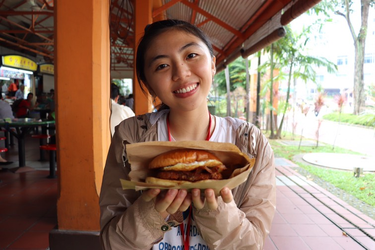

```{r setup, include=FALSE}
knitr::opts_chunk$set(echo = FALSE)
```


# Hi!
I'm Gabriella, a data analyst and a data scientist in training based in Singapore. I am currently pursuing Master of IT in Business degree from Singapore Management University while doing internship in UOB Asset Management. Coding aside, I enjoy eating and baking. For me, data is a treasure chest that gives you a hope of making the world a little bit better, one insight at a time. 

I hope you have a good day, God bless you!